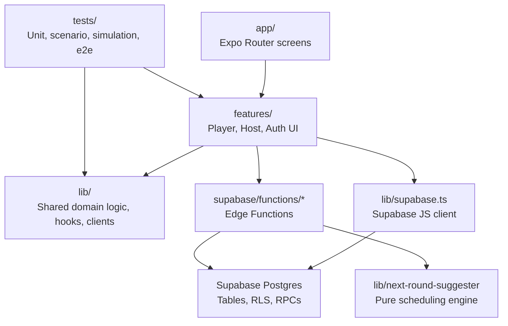
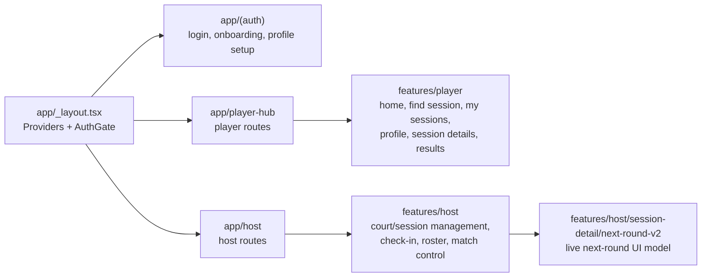
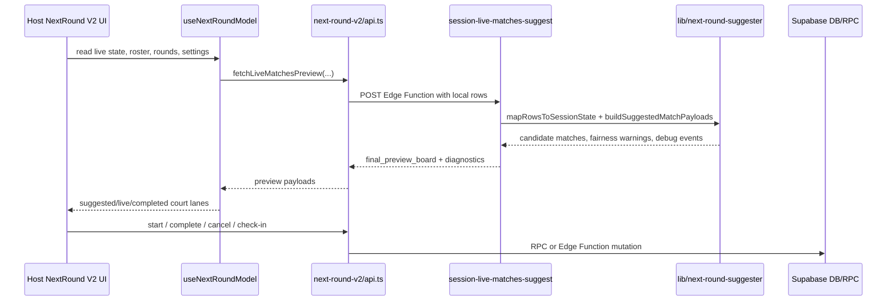
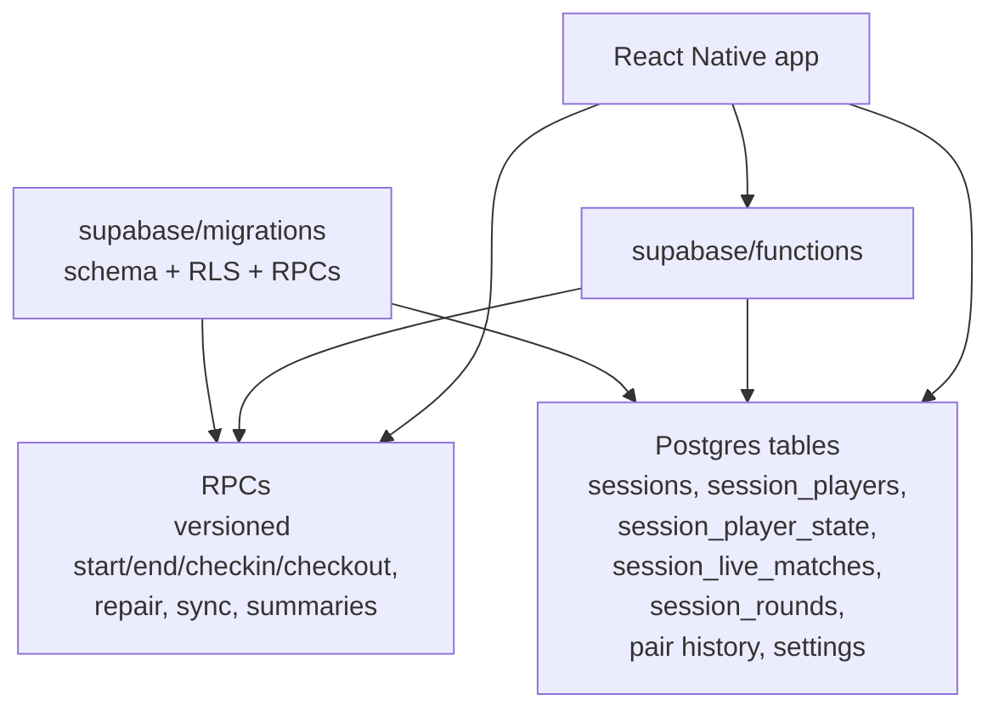
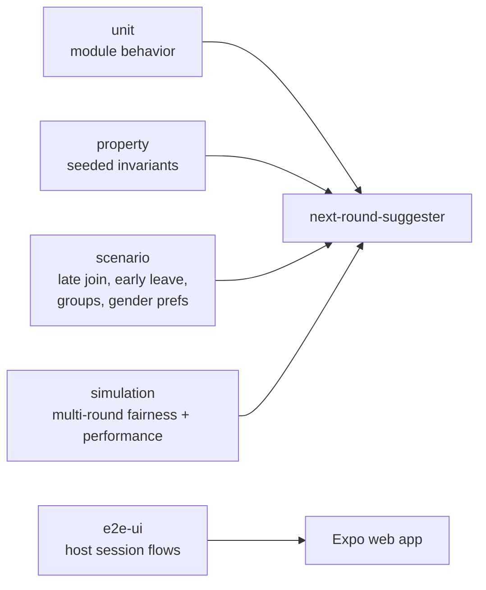

# PickleMatch Web Codebase Map

This repo is an Expo Router / React Native Web app for pickleball sessions, with Supabase as the database, auth provider, RPC layer, and Edge Function runtime.

## High-Level Shape



## Main Frontend Areas



## Next-Round / Live Match Flow

This is the most sophisticated part of the app.



## Important Directories

| Path | Role |
|---|---|
| `app/` | File-based routes. Mostly thin route wrappers around feature screens. |
| `features/player/` | Player-facing flows: home feed, find session, profile, session details, reviews/results. |
| `features/host/` | Host-facing flows: dashboard, court management, session detail, roster, check-in, live match controls. |
| `features/host/session-detail/next-round-v2/` | UI/model layer for live next-round board: queries, mutations, court lanes, preview, sheets, controls. |
| `lib/next-round-suggester/` | Pure scheduling engine: state mapping, player selection, pairing, scoring, fairness, live preview, commit/history. |
| `lib/court-calculator/` | Court capacity, preset, feasibility, and warning calculations. |
| `supabase/functions/` | Edge Functions for live session actions, roster sync, fairness, summaries, ratings, and rest requests. |
| `supabase/migrations/` | Database schema, RLS, RPCs, live-session tables, debug/instrumentation migrations. |
| `tests/next-round-suggester/` | Deep engine coverage: unit, property, scenario, fairness, and simulation tests. |
| `tests/e2e-ui/` | Playwright web UI coverage. |

## Core Concepts

| Concept | Source Of Truth |
|---|---|
| Auth/session client | `lib/supabase.ts`, `lib/useAuth.ts` |
| Global providers | `app/_layout.tsx` |
| Host session detail | `features/host/session-detail/HostSessionDetailScreen.tsx` |
| Next round screen | `features/host/session-detail/NextRoundSuggesterScreenV2.tsx` |
| Live round model | `features/host/session-detail/next-round-v2/useNextRoundModel.ts` |
| Live function API wrapper | `features/host/session-detail/next-round-v2/api.ts` |
| Suggester state model | `lib/next-round-suggester/types.ts`, `state.ts` |
| Match generation | `lib/next-round-suggester/suggest.ts`, `pair.ts`, `score.ts`, `select.ts` |
| Fairness | `lib/next-round-suggester/fairness/*` |
| Live preview building | `lib/next-round-suggester/live-preview.ts` |
| Preview Edge Function | `supabase/functions/session-live-matches-suggest/index.ts` |

## Database / Backend Shape



Recent active migration work includes debug/instrumentation support:

- `debug_dumps.chosen_matches`
- `debug_dumps.pvna_tolerance`
- `debug_dumps.rounds`
- `engine_instrumentation` table with authenticated insert policy

Replay/audit model for live-lane stabilization:

- `debug_dumps.payload` is the replay source of truth for reconstructing a live suggestion request.
- `session_audit_events` is the timeline/index layer that links client preview attempts, edge requests, and outcomes by request IDs.
- `engine_instrumentation` stores lightweight engine-side events for search pressure and fallback diagnostics.
- When `VERIFY_DUMP=1`, `session-live-matches-suggest` should register debug dump writes with `EdgeRuntime.waitUntil` so a returned response does not race the replay capture.

## Testing Strategy



Useful commands:

```bash
npm run typecheck
npm run test:suggester
npm run test:suggester:unit
npm run test:suggester:fairness
npm run test:suggester:simulation
npm run build:web
```

## Mental Model

The app has two broad products inside one codebase:

1. Player marketplace: find, join, review, and manage pickleball sessions.
2. Host operations console: create/manage sessions, check players in, run live matches, and optimize next-round pairings.

The host live-match system is where most complexity lives. The frontend keeps a rich local model of live rows, settings, and optimistic mutations. Preview generation is delegated to a Supabase Edge Function, but that function mostly runs pure TypeScript from `lib/next-round-suggester`, which makes the scheduling engine highly testable without Supabase.
