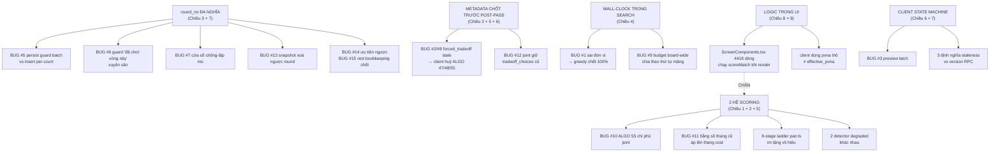

# ENGINE FRAGMENTATION AUDIT — PickleMatch

**Ngày:** 2026-08-08 · **Branch:** `feat-quality-cost-model` · **Phạm vi:** engine xếp trận + tầng persist/RPC + client host-live + UI/UX
**Phương pháp:** multi-agent read-only — 9 agent audit song song (1 chiều/agent) → dedup 56 candidate bug → **61 agent đối kháng cố refute** (3 đợt) → doc này.
**Không có dòng code/schema nào bị sửa trong audit này.**

| Số liệu | Giá trị |
|---|---|
| Chiều audit | 9 |
| Candidate bug (sau dedup) | 56 |
| Được verify đối kháng | **56/56 — không còn cái nào chưa kiểm** |
| **CONFIRMED (có repro)** | **43** |
| REFUTED | 13 |
| Verify 2 lần (kiểm chứng chéo) | 5 — cả 5 đều CONFIRMED ở cả hai lượt |

**Phân bố severity sau khi verifier hiệu chỉnh:** 15 HIGH · 12 MEDIUM · 16 LOW (14 root HIGH riêng biệt — #2 và #8 chung một gốc).
Rất nhiều candidate được audit gắn high/medium bị hạ xuống low sau khi verifier **đo tác động thật** — con số dưới đây là severity đã hiệu chỉnh, không phải severity do agent audit tự gắn.

---

## 1. Tóm tắt điều hành

Hệ thống không phân mảnh ở một chỗ — nó phân mảnh ở **6 tầng cùng lúc**, và các mảnh đó *nói khác nhau về cùng một sự thật*:

1. **Hai hệ scoring** (`score.ts` hard-gate INFINITY vs `quality-cost.ts` soft cost) sống song song trong cùng một hàm `scoreMatch`, chia nhau bằng **một dòng `if`** (score.ts:622). Flag-ON làm early-return **trước mọi hard gate** → toàn bộ thang 8-stage relaxation của `pair.ts`, chặn rematch nguyên-4-người, và cap intra 0.75/1.0 **im lặng vô hiệu**. Fix ALGO 55 "within-tol-first" chỉ nằm trong `bestSplitForFoursome` — tức **chỉ phủ path joint ≥2 sân**; path live 1 sân vẫn mua được việc vượt tolerance bằng gender-pref (BUG #10, đã repro).
2. **15 path sinh lineup** (P1–P15) + **7 post-pass repair** chạy nối đuôi, không pass nào biết pass kia tồn tại; có pass (`invariantSafePayloads`) *vứt toàn bộ kết quả* của 4 pass trước.
3. **`round_no` mang ≥4 nghĩa** (bộ đếm chu kỳ per-court / trục thời gian recency / khoá guard "đã chơi vòng này" / đơn vị kế toán nghỉ). Fix per-court (migration 20260808000001) đã **đúng cho hiển thị** nhưng làm 3 nghĩa còn lại sai lệch — sinh ra 4 bug CONFIRMED riêng biệt.
4. **Client là một engine thứ hai**: nó tự tính lại PVNA (bằng `pvna` thô thay vì `effective_pvna`), tự chấm điểm bằng model CŨ, tự suy 5 công thức "số vòng", và **tự chọn lineup cuối cùng** từ metadata được chốt TRƯỚC repair — nghĩa là client có thể ghi đè chính các fix ALGO 47/48/55 (BUG #2/#8).
5. **Tầng persist bị revert âm thầm**: migration 20260722000004 chép nguyên thân hàm cũ đè lên 5 migration text-patch trước đó → guard "đã chơi vòng này" **sống lại**, `cycle_no` **mất writer**, `suggestion_metadata` **mất chỗ lưu** (BUG #4).
6. **Determinism**: `force_budget_deadline` truyền `performance.now()` nhưng được so với `Date.now()` → **toàn bộ greedy 4-pass timeout ngay mili-giây đầu tiên trên mọi request** (BUG #1). Đây là phát hiện nghiêm trọng nhất: board hiện tại không phải do thuật toán chính sinh ra.

### 5 việc nên làm trước (chi tiết ở §4)

| # | Việc | Vì sao trước |
|---|---|---|
| **P0-1** | Sửa đơn vị `force_budget_deadline` (BUG #1) | Mọi đo đạc chất lượng/calibration từ trước tới nay đều đo trên engine **đã chết pass chính**. Không sửa cái này thì mọi A/B khác đều vô nghĩa. |
| **P0-2** | Chốt "lineup persist là chân lý duy nhất" — drop/tái tính `forced_tradeoff` + `tradeoff_choices` sau post-pass (BUG #2/#8/#12/#19) | Đang trực tiếp vô hiệu hoá ALGO 47/48/55 trên đúng những sân có panel, và có nguy cơ double-book. |
| **P0-3** | Sửa `previewRequestInFlightRef` latch (BUG #3) | Board có thể **ngừng gợi ý vĩnh viễn** cho tới khi host reload — không có watchdog nào cứu. |
| **P0-7** | Rest bookkeeping: bỏ điều kiện "round complete" gom theo `round_no` toàn session (BUG #15) | `consecutive_rest`/`consecutive_play` **không được cập nhật** khi các sân lệch chu kỳ — tức nền tảng công bằng của engine đang chạy trên số liệu chết. Verify trên **dữ liệu prod thật**. |
| **P0-8** | `buildRelaxedTierOverrides` không được xoá tag FLEXIBLE của người bị defer (BUG #17) | Mọi rescue path đang **đòi lại đúng người vừa defer** ⇒ ALGO 37/48/54 bị vô hiệu ngay trong cùng một request. |

Sau 5 việc trên mới nên bàn consolidation thật (hợp nhất scoring → hợp nhất round model → gộp post-pass).

> **Cụm nghiêm trọng nhất không phải scoring.** Bốn trong sáu bug HIGH của tầng persist (#5, #6, #14, #15) đều bắt nguồn từ **một quyết định duy nhất**: `round_no` vừa là chu kỳ per-court vừa là trục thời gian toàn session. Sửa từng bug một sẽ không dứt; phải tách khái niệm (P1-4) trước.

---

## 2. Bản đồ fragmentation (9 chiều)

### Chiều 1 — Scoring (severity: HIGH)

**Các mảnh cạnh tranh**

| Mảnh | Vị trí | Thang đo | Ai dùng |
|---|---|---|---|
| `scoreMatch` nhánh legacy | `score.ts:638-719` | điểm phạt 1–300 (partner×3, opp×1.5, gender 4/2, severe-repeat **50**) | `pair.ts:80`, `pair.ts:356` → `bestPartitioning` → mọi alternative |
| `scoreMatch` nhánh cost | `score.ts:622-636` | cost 0.1–10 | **cùng call-site** — 1 dòng `if` đổi ngữ nghĩa cả hàm |
| `computeQualityCost` | `quality-cost.ts:104-148` | cost soft, `1.6*over²`, gender 0.4/0.2, repeat3 3.6 | score.ts:625, forced-tradeoff.ts:48/86/139, live-preview.ts:3418/3945 |
| `bestSplitForFoursome` (ALGO 55) | `quality-cost.ts:159-185` | **lexicographic (overTol, cost)** | **chỉ** `jointRepartition` — không ai khác |
| `findMinCostFoursome` (ALGO 53) | `forced-tradeoff.ts:125-147` | cost thuần (không lexicographic), **không gate flag** | `suggest.ts:1105` — chọn AI CHƠI cho pool 4–20 |
| `shouldReplaceBestPartition` | `pair.ts:106, 222-259` | hằng số tuyệt đối **3** (thang CŨ) | mọi lựa chọn board full |
| Client | `useNextRoundModel.ts:420-438`, `manual-swap.ts:71`, `ScreenComponents.tsx:2859` | **luôn model CŨ** | badge "Điểm ghép", SwapSheet, verdict chất lượng |

**Bất đồng chính**

- **Cùng 1 foursome → 3 kết quả khác nhau** tuỳ điểm vào: hard-gate / cost thuần / cost lexicographic. → BUG #10 (CONFIRMED).
- **Gate flag lệch nhau**: chỉ `session-live-matches-suggest/index.ts:924` set cờ. `session-rounds-suggest` và `session-plan-shadow` rơi về fallback env → session **ngoài allowlist vẫn chạy model mới**. Client thì **không bao giờ** có cờ → luôn model cũ (quality-cost-flag.ts:20-26).
- **Thang 8-stage relaxation `pair.ts:805-997` vô hiệu hoàn toàn dưới flag ON** (early-return trước mọi gate) — mọi patch dựa trên "stage nào tìm ra kết quả" (Stage 5.5/6 blowout guard) im lặng.
- **Chỉ thị host "lặp-3 phải thua"** (`SEVERE_REPEAT_PAIR_PENALTY=50`, ALGO 44) bị nới thành `repeat3=3.6` → sim calibration ghi nhận rep-3/session tăng 0.8→2.2.
- **Chặn `hasRecentGroupRematch` (rematch nguyên 4 người) biến mất** ở model mới — `computeQualityCost` không có số hạng rematch.
- **Số hiển thị trộn 2 thang**: "Điểm ghép 1.2" (server, cost) cạnh "Điểm ghép 34.5" (client recompute sau manual swap).

**Đề xuất hợp nhất:** đóng gate (bỏ fallback env, gate `suggest.ts:1105`) → đưa lexicographic `(overTol, cost)` vào **một comparator duy nhất** dùng chung cả 3 chỗ → đổi đơn vị các hằng số còn sót thang cũ (`pair.ts:106`) → chọn 1 model, chuyển 4 hard-gate cũ thành bậc lexicographic → client ngừng tự chấm điểm.

---

### Chiều 2 — Path sinh trận (severity: HIGH)

**15 path** (P1–P15) cùng sinh lineup. Đường production chính: `buildSuggestedMatchPayloads` (P5, live-preview.ts:4118-5632) → greedy per-court `suggestNextMatch` (P2) → fast-path tất định (P3a) hoặc legacy timed loop (P3b) → **7 post-pass** (P6).

**Thứ tự post-pass** (live-preview.ts):
```
5562 repairSuggestedPayloadBatch (tự nó = 3 pass lồng nhau)
5566 repairAllIdlePayloadBatchParticipation
5582 repairPayloadBatchSevereRepeatFromPool     (ALGO 47)
5594 repairPayloadBatchBlowoutFromPool          (ALGO 48)
5601 invariantSafePayloads  ← VỨT TOÀN BỘ 4 pass trên nếu rollingPlanTarget active (#70, dormant)
5623 applyJointRepartition                      (ALGO 55)
5626 normalizeRepairedPayload({clearTradeoffChoices:false})
```

**Bất đồng chính**

- **Pool 20 vs 21 đổi hẳn tiêu chí chọn người**: `suggest.ts:1105` gate `<= 20` → fast-path dùng `computeQualityCost` (gender 0.4); pool 21 rơi xuống legacy loop dùng `scoreMatch` (gender 4). Trong khi `FORCED_TRADEOFF_MAX_POOL = 28` — hàm thừa sức chạy tới 28.
- **Bộ rescue chạy phụ thuộc HÌNH DẠNG REQUEST, không phụ thuộc state**: conditional quality rescue chỉ khi `effectiveCount >= courtCount`; unified social tradeoff chỉ khi `count === 1`; rolling beam vs legacy beam loại trừ nhau. → host bấm "xếp cả bàn" và để sân tự refill từng cái đi qua **hai bộ rescue loại trừ nhau** trên cùng state.
- **Required-set bị tính lại 2 lần** (live-preview vs suggest.ts:534-548) — cơ chế "defer" chỉ là tag mềm, mọi rescue dùng `buildRelaxedTierOverrides` **xoá tag đó** → blowout quay lại.
- **Rescue toàn bàn chạy engine với profile khác hẳn** (`index.ts:1276-1289` thiếu `blowoutRescue`, `rollingHorizon`, `deferExtremeTightPool`) → khi rescue thắng, board **mất sạch** degraded_reason/rescue/explanations/forced_tradeoff — đúng lúc board đang blowout.
- **Lineup được PERSIST khác lineup được HIỂN THỊ/CHƠI** → BUG #2/#8.
- **Quy ước metadata sau repair ngược nhau**: repair xoá `tradeoff_choices` của cả batch; joint thì giữ nguyên cái đã cũ → hai lỗi trái dấu trên cùng một trường (BUG #12 + #19).
- **2 bộ sinh trận độc lập + 1 fork chết**: suggester engine (`session_live_matches`) vs `roundRobinScheduler` (`session_matches`, rng = `Math.random`) vs fork client `preview.ts:481-928` (không ai gọi).

**Canonical nên giữ:** P5 + P2 + P3a + 1 optimizer hợp nhất.
**Nên retire:** P3b legacy loop, P10 fork client, P9 client fallback, legacy beam, P5-E7 `findStrictCleanLiveAlternative`.

---

### Chiều 3 — Round numbering (severity: HIGH)

**Có 4 hệ đánh số round song song:**

| Hệ | Vị trí | Ngữ nghĩa |
|---|---|---|
| `reconstructLiveRounds` | `live-rounds.ts:43-73` | 3 nhánh: `cycle_no` → `round_no` (nếu "đáng tin") → `floor(index/roundSize)` |
| `payloadRoundNo` (engine) | `live-preview.ts:4408-4411` | **per-court**: `lastCompletedRoundByCourt + 1` |
| `v_round_no` (RPC) | `20260808000001:128-143` | **batch**: `max(round_no) over TẤT CẢ target courts + 1` |
| `round_no` INSERT (RPC) | `20260808000001:268-275` | **per-court**: `max(round_no) của riêng sân đó + 1` |
| Client local-fallback | `useLiveBoard.ts:2176-2180` | `floor(tổng trận / số sân)` |

**`round_no` mang 4 nghĩa xung đột:**

| Nghĩa | Nơi dùng | Hậu quả khi lệch |
|---|---|---|
| Bộ đếm chu kỳ per-court | INSERT persist, hiển thị lane | (đúng sau fix 08-08) |
| Trục thời gian recency | `score.ts:169-177`, `:252-259`, `pair.ts:555-556`, `quality-cost.ts:45` | **BUG #7** — cửa sổ chống-lặp mù |
| Khoá guard "đã chơi vòng này" | `20260808000001:189-192`, `20260721000001:96-104` | **BUG #5, #6** — persist/start bị từ chối |
| Đơn vị kế toán nghỉ | `20260726000002:95,154-192` | `consecutive_rest` +1 oan cho người đang chơi liên tục ở sân nhanh |

- **`cycle_no` đã chết**: cột tồn tại (20260710000001) nhưng cả 3 patch ghi nó đều bị `CREATE OR REPLACE` toàn thân đè mất → **không còn writer nào**. `canonicalCycleNoAvailable` luôn `false` → `reconstructLiveRounds` **luôn phải đoán**.
- **`last_played_round > current_round` là hợp lệ** dưới per-court numbering, nhưng `fairness/metrics.ts:480-492` và `select.ts:49-50` giả định ngược lại.
- **"VÒNG x / y" trộn đơn vị**: tử số = chu kỳ per-court, mẫu số = `targetRounds` toàn kèo → host thấy "VÒNG 4/8" và "VÒNG 7/8" cùng lúc.

**Đề xuất:** tách hẳn 3 khái niệm — `court_cycle_no` (hiển thị) / `session_seq` (recency, dùng `sequence_no` sẵn có) / khoá guard riêng. Bỏ guard cross-court (khôi phục ý định 20260703000008).

---

### Chiều 4 — Determinism (severity: CRITICAL)

**Nguồn non-determinism đã map:**

| Nguồn | Vị trí | Cơ chế |
|---|---|---|
| Greedy 4-pass timed search | `suggest.ts:580-725` | `Date.now()` deadline; chiến lược tránh-lặp chạy CUỐI → bị starve trước tiên |
| `force_budget_deadline` sai đơn vị | `live-preview.ts:4133,4580` vs `suggest.ts:586` | **BUG #1** — `performance.now()` (~1e4) so với `Date.now()` (~1.79e12) |
| Legacy combo loop (pool >20) | `suggest.ts:1190-1296` | 8 stage đều `break` theo `timedOut()` |
| `bestPartitioning` random-restart | `pair.ts:747-757` | seeded shuffle nhưng có đồng hồ tường |
| Rolling-horizon beam | `planner/rolling-horizon.ts:428-691` | candidate duyệt sớm chạy đủ path, candidate sau bị cắt → **điểm không cùng đơn vị so sánh** |
| Budget batch per-court | `live-preview.ts:4387-4396` | `remainingBatchMs <= 350 → break` giữa chừng |
| `findRescueCourts` | `live-preview.ts:3884` | budget chung, trừ dần theo thứ tự mảng → **BUG #9** |
| `shuffleCopy` | `lib/scheduler/fixedTeamPairing.ts:37` | `sort(() => Math.random() - 0.5)` — không caller nào (dead) |

**Bất đồng:** `findMinCostFoursome` là **tất định**, nhưng gate caller là 20 còn hàm chịu được 28 → pool 21–28 (rất phổ biến ở kèo 30–40 người) rơi xuống loop non-deterministic.
Ngoài ra "Chờ Sân X" có **2 bộ máy tính khác nhau** (`findRescueCourts` có budget vs `simulateWaitWouldClean` pure) cho **2 danh sách khác nhau trên cùng board**.

---

### Chiều 5 — Patch inventory (severity: HIGH)

**22 patch/special-case đã kiểm kê.** Phân loại:

| Loại | Patch |
|---|---|
| **Trị gốc** (generator/selection) | `selectRequiredIdsForCourt` band-cap (ALGO 49), corrector no-global-relax (ALGO 50), `deferLowViabilityRequiredIdsForCourt` A+B (ALGO 37/48/54) |
| **Trị triệu chứng** (post-pass) | `repairPayloadBatchSevereRepeatFromPool` (47), `repairPayloadBatchBlowoutFromPool` (48), `repairPayloadBatchRepeatExposure`, `repairEarlyPayloadBatchQuality*`, `repairAllIdlePayloadBatchParticipation`, `applyJointRepartition` (55) |
| **Metadata-only** | `forced_tradeoff` blowout (54) + repeat (52), `wait_rescue_options`, `buildOverThresholdRepeatTradeoff` (38) |
| **ĐÃ CHẾT nhưng vẫn tính toán end-to-end** | `shouldDeferTightPoolSuggestion` + `TIGHT_POOL_QUALITY_WAIT_MS` + banner client — nằm ở nhánh `else if` của `blowoutRescue`, mà edge **luôn bật** `blowoutRescue` (index.ts:1043) → **unreachable** |
| **Dormant** | `invariantSafePayloads` (#70) — plan-consumption đã tắt |

**Patch đánh nhau (đã xác minh file:line):**

- `repairAllIdlePayloadBatchParticipation` (5566) **kéo người owed VÀO** với guard `restMisses` không tăng → `repairPayloadBatchBlowoutFromPool` (5594) **bench chính người đó ra**, vì pass này **không hề đọc** `consecutive_rest`/`matches_played` (chỉ có `hasNearLevelPeer`).
- Cùng lỗi đó phá vỡ bất biến mà Branch A/B (ALGO 54) dựng ra: A chỉ defer khi `consecutive_rest === 0`, B để host quyết khi `rest > 0` — nhưng blowout repair bench thẳng, không hỏi ai.
- **Hai detector blowout/repeat khác nhau** cho cùng signal: fill loop dùng heuristic legacy (5119-5124, không rẽ nhánh flag), edge board-wide dùng `computeMatchDegradedRescue` (3945-3957, CÓ rẽ nhánh flag) và **ghi đè** giá trị của fill loop → gate của blowout repair có thể fire cho sân mà cờ cuối cùng host thấy là SẠCH.
- **Hai kênh host-facing cho cùng triệu chứng lặp**: `tradeoff_choices` ("Ít lặp hơn", ALGO 38) và `forced_tradeoff` ("③ Chịu lệch", ALGO 52). Client `ScreenComponents.tsx:1754-1756` cho `forcedDecision` chạy TRƯỚC → khi cả hai cùng có, **kênh ALGO 38 chết im lặng**.

---

### Chiều 6 — Client orchestration (severity: CRITICAL)

`useLiveBoard.ts` (3222 dòng) chứa một state machine với **1 effect 1484 dòng** (`:1713-3197`) có **9 deps** nhưng đọc **~15 giá trị closure** ngoài deps.

**Các mảnh điều phối cạnh tranh:**

| Ref/state | Vị trí | Vấn đề |
|---|---|---|
| `previewRequestInFlightRef` | `:191` set `:1977`, clear ở **4 nơi với 4 điều kiện khác nhau** | **BUG #3** — cleanup abort không clear |
| `previewRequestSerialRef` | `:193`, bump ở 3 nơi ngoài effect | 3/4 đường huỷ **không lên lịch chạy lại** |
| `suggestedPreviewBatchRef` | `:189`, clear ở **>10 chỗ** | — |
| `suggestedLaneCacheRef` | `:190`, **5 writer + ~9 clearer** | writer nằm trong getter (`:1417`) |
| `liveStateVersionRef` | `:252-260` monotonic max | poll 4s có thể nâng version bằng chính version request đang bay vừa persist → response bị vứt |
| `scheduleReconcile` | `NextRoundSuggesterScreenV2.tsx:180-220` | **KHÔNG producer nào set `reconcile`** → bail ngay dòng đầu = no-op hoàn toàn |

**Bất đồng chính**

- **"Board đã đầy chưa?"** có **2 hàm cho 2 câu trả lời khác nhau**: `getCurrentPreviewBoardForEdge` (5 bộ lọc) vs `getReusableSuggestedLaneMatches` (9 bộ lọc + side-effect ghi cache) — kết quả dùng chéo nhau ở `:2509-2516`.
- **Staleness có 3 định nghĩa** trên cùng một version (`isPreviewResponseCurrent` bằng-nhau / `liveStateVersionRef` monotonic / version-poll lớn-hơn).
- **Sân vừa kết thúc**: hydrate effect coi là OCCUPIED, effect preview coi là CẦN THAY THẾ — trong cửa sổ ~3s.
- **Quality-gate chấm bằng `state` deferred/đóng băng, payload gửi bằng `rows` tươi** → host check-out 1 người: edge trả board hợp lệ, client chấm bằng state cũ → kết luận "hard quality violation" → ép full_board.
- **`preview_source: 'edge_committed'` bị dán cho id CLIENT tự sinh** (nhánh legacy `:2810-2815`) → mọi gợi ý hiện ra **không Start được**.
- **Watchdog duy nhất của board** là watchdog 3s trên đường complete (`:1144-1170`) — không có mạng an toàn cho các đường im lặng khác.

---

### Chiều 7 — Persist / RPC (severity: CRITICAL)

| RPC | Migration | Vai trò |
|---|---|---|
| `replace_live_session_suggestions_versioned` | `20260808000001:9-322` | persist chính; CAS version; `v_round_no` batch; INSERT round per-court |
| `replace_planned_..._versioned` | `20260716000001:68-121` | CAS 2 chiều rồi delegate |
| `replace_manual_..._versioned` | `20260715000001:119-233` | lineup host sửa tay |
| `start_live_session_match_versioned` | `20260721000001:23-135` | suggested→live; **bỏ CAS**, giữ guard round |
| `start_..._from_payload_versioned` | `20260722000006:12-250` | start thẳng từ payload, **tự tính round_no per-court** |
| `complete_...` | `20260726000002:9-210` | bookkeeping fairness khoá theo `round_no` |
| `cancel_...` | `20260722000005:16-150` | **bản SAO CHÉP** logic round-completion rest của complete |
| `get_live_session_snapshot_versioned` | `20260703000005:125-198` | synthetic round rows — nguồn `state.rounds` của engine |
| `sync_live_suggestion_degraded_fields` | `20260803000003` | match theo court **+ team** |
| `sync_live_suggestion_metadata` | `20260805000010` | match **chỉ theo court**, không CAS |

**Bất đồng chính**

- **Engine nói CÓ, RPC nói KHÔNG** về việc tái sử dụng người "đã chơi vòng này" trong rolling lane (`live-preview.ts:4418-4420` vs `20260808000001:189-192`) → RPC ném exception → edge trả 500 → **sân trống không có gợi ý**. Client đã phải viết nguyên một nhánh phục hồi cho chuỗi lỗi này.
- **Payload engine có 23 field, RPC INSERT 11 cột** → **14 field bị drop vĩnh viễn** (`warnings`, `tradeoffs`, `approval_required`, `tolerance` cấu hình/hiệu lực, `fairness_reasons`, `tradeoff_choices`, `recommended_tradeoff_choice`, `live_availability_context`…). Ba cơ chế bù đắp chồng lên nhau (2 RPC sync + 1 reattach in-memory), mỗi cái match theo tiêu chí khác nhau.
- **Text-patch migrations vs full-body CREATE OR REPLACE**: 5 migration sửa RPC bằng `pg_get_functiondef` + string-replace, sau đó bị 20260722000004 (và 20260721000001/20260803000001/20260808000001) chép đè → **BUG #4**.
- **Guard host trong RPC là NO-OP trên đường edge**: mọi RPC chạy bằng service role → `auth.uid()` = NULL → `v_host_id <> NULL` = NULL → nhánh IF không chạy. (Không phải lỗ hổng — edge đã check — nhưng mọi pgTAP test viết dựa trên guard đó đang test cái không chạy.)
- **Comment lỗi thời**: `_shared/preview-degraded-fields.ts` vẫn nói "RPC chỉ INSERT 8 cột" trong khi 3 cột degraded đã được lưu từ 20260803000001.

---

### Chiều 8 — UI/UX kiến trúc (severity: HIGH)

**"Hai thế giới"**

- **Thế giới mới** (controller-hook + api.ts + thin-screen): `next-round-v2/`, `host-match/`, 6 feature player, 3 feature host.
- **Thế giới cũ**: **32 file `.tsx` import thẳng `@/lib/supabase`**. Nặng nhất: `HostRosterSection.tsx` (8 lần `.from`), `OnboardingScreen.tsx` (6), `EditCourtScreen.tsx` (6), `SessionReviewScreen.tsx` (6), `app/host/claim-court.tsx` (6).

**God components (>800 dòng, ngoài lib/ và edge):** `ScreenComponents.tsx` **4418** (45 export, 47 hook call) · `useLiveBoard.ts` 3222 · `HostMatchScreen.tsx` 1187 · `OnboardingScreen.tsx` 1168 · `HostRosterSection.tsx` 1099 · `NextRoundSuggesterScreenV2.tsx` 981 · `SessionActionButtons.tsx` 968 · `app/register/[id].tsx` 961 · `preview.ts` 928.

**Trùng lặp đã lệch nhau (nguy hiểm hơn trùng lặp thường):**

| Thứ | Bản | Đã lệch? |
|---|---|---|
| `buildSuggestedMatchPayloads` | `preview.ts:481-928` vs `live-preview.ts:4118` | **CHẾT** (0 import) nhưng vẫn compile |
| `buildPreviewBatchKey` | `preview.ts:179-236` vs `live-preview.ts:738-794` | **ĐÃ LỆCH** — bản engine có `effective_pvna`, bản client không |
| `buildProjectedStateAfterLiveMatch` | `preview.ts:120-177` vs `live-preview.ts:641-717` | còn đồng bộ (bản client đang chạy thật ở `:955`) |
| Đo PVNA | `state.ts:441 getEffectivePvna` vs `helpers.ts:34 getTeamPvna` vs `preview-helpers.ts:9` | **ĐÃ LỆCH** — client dùng `pvna` thô |
| `formatNumber` | `helpers.ts:6` (0 chữ số) vs `preview.ts:307` / `live-preview.ts:1311` (1 chữ số) | **ĐÃ LỆCH default** |
| `nowMs` | 5 bản client + 1 engine | — |
| "Số vòng" | **5 công thức song song** | **ĐÃ LỆCH** |

**Rò rỉ nghiêm trọng nhất:** `ScreenComponents.tsx` **chạy lại engine scoring bên trong render** — `scoreMatch()` (`:2859`), `getProjectedRepeatSummary()` (`:1647`), `computeRepeatPressure()` (`:4018`), `reconstructLiveRounds()` (`:1613`) — với **hằng số cứng của `score.ts`**. Nghĩa là: **không thể đổi cost model của engine mà không sửa đồng thời file 4418 dòng**. Đây chính là thứ chặn consolidation ở Chiều 1.

*(Ghi nhận: `lib/next-round-suggester/**` SẠCH — grep react/react-native/@supabase = 0 hit. Rò rỉ nằm ở `lib/` gốc: `NetworkContext.tsx`, `useAuth.ts`, `theme-context.tsx`…)*

---

### Chiều 9 — UI/UX design (severity: HIGH)

**4 hệ token màu song song** dù `DESIGN_SYSTEM.md:8-9` cấm rõ:

| Hệ | Quy mô |
|---|---|
| A — `profileTheme` → `constants/theme` → `useAppTheme` (**chuẩn**) | 128/164 file |
| B — `constants/colors.ts` (bảng màu tĩnh riêng) | **1 consumer**: `ScreenComponents.tsx:18` |
| C — hex hardcode inline | **621 hex / 29 file** (`HostMatchScreen` 202, `HostRosterSection` 100, `ScheduleCoverageReport` 87 + **0 lần** `useAppTheme`) |
| D — NativeWind với `theme.extend = {}` rỗng | 127 arbitrary-value class (`text-[11px]`×18…) |

**3 hệ chuỗi song song:** i18next `t()` (**chỉ 12/164 file ≈ 7%**, chỉ có locale `vi`) · `constants/strings.ts` (38 file, **trùng nội dung** với vi.json) · **935 literal tiếng Việt hardcode trên 92/164 file**. **Nhánh host (`features/host` + `app/host`) có 0 file dùng `useTranslation`** → không thể dịch.

**Trạng thái không nhất quán:** 4 kiểu loading (AppLoading 22 file / ActivityIndicator thô 31 file / 2 spinner tự chế trong lane) · confirm 2 kiểu (`Alert.alert` 30 lần vs `window.confirm` tự viết ở 4 màn host quan trọng nhất, dù `AppDialog` tồn tại với 23 consumer).

**UI chết trong `ScreenComponents.tsx`:** 5 khối `{false ? …}`, 7 `display:'none'`, **11 component export không ai render** (gồm `EngineConstraintNotice` và `EmptyPlanCard` — **2 surface DUY NHẤT** giải thích "engine bị chặn" / "trận vượt cấp").

**Mâu thuẫn host-facing (đọc được từ điều kiện render):**

- **6 kênh giải thích song song** trên 1 thẻ suggested match (`capacityInfoLines`, `engineWarnings`, `decisionCards`, `degradedRescueTitle`, `forcedDecision.explanation`, `matchExplanations`) — mỗi khối tính "lý do" theo công thức riêng, không tham chiếu nhau.
- **`playCostText` nói "không đánh đổi gì"** (`:1971-1979`, không đọc `pvnaOverBy`) ngay cạnh **`capacityInfoLines` nói "Hai đội chênh nhau hơn bình thường"** (`:2044-2053`) → host tin không mất gì nên bấm "Chơi luôn" — đúng loại trận lệch mà ALGO 48/50/55 đang cố tránh.
- **`RestRiskBanner` ("xếp X vào trận tới") và banner quality-defer ("để sân trống là có chủ đích") luôn đồng hiện theo cấu trúc** — 2 chỉ dẫn ngược nhau cạnh nhau.
- `docs/UI_CONTEXT.md` mô tả cây route **không tồn tại** (đường dẫn absolute của máy khác) → không còn dùng tham chiếu được.

---

## 3. Cross-reference — các chủ đề xuyên chiều



**Bốn chuỗi cần đọc cùng nhau:**

1. **`round_no` đa nghĩa (Chiều 3 ⟂ Chiều 7)** — fix per-court 08-08 đúng cho hiển thị nhưng **tạo ra 4 bug** ở 3 nghĩa còn lại. Không thể sửa lẻ từng bug: phải tách khái niệm trước.
2. **Staleness (Chiều 6 ⟂ Chiều 7)** — client có 3 định nghĩa "response còn tươi không", tầng RPC có CAS `live_state_version`, và version-poll 4s có thể tự nâng version làm response hợp lệ bị vứt. Ba tầng cùng nói về một con số.
3. **Logic-trong-UI (Chiều 8) CHẶN consolidate engine (Chiều 1)** — quan hệ phụ thuộc cứng: chừng nào `ScreenComponents.tsx` còn `import { scoreMatch, MAX_PROJECTED_*, INTRA_TEAM_PVNA_GAP_LIMIT }`, đổi cost model = sửa file 4418 dòng. **Phải tách `verdict.ts` ra khỏi component trước khi hợp nhất scoring.**
4. **Metadata phái sinh (Chiều 2 ⟂ Chiều 5 ⟂ Chiều 6)** — engine chốt `forced_tradeoff`/`tradeoff_choices` TRƯỚC post-pass, edge sync riêng, client **seat theo metadata** chứ không theo lineup persist. Đây là lý do các fix engine "không có tác dụng" trên đúng những sân có panel.

---

## 4. Roadmap consolidation ưu tiên

Ký hiệu: 🩹 = trị triệu chứng · 🌱 = trị gốc · ⛔ = chặn bước sau.

### P0 — Chặn máu (làm ngay, độc lập nhau, không phải consolidation)

| # | Việc | Loại | Verify | Rủi ro |
|---|---|---|---|---|
| P0-1 | Sửa đơn vị `force_budget_deadline` (BUG #1). Khuyến nghị: đổi thành `force_budget_ms` (thời lượng) để **không thể sai đơn vị**; hoặc guard `suggest.ts:586` bỏ qua deadline < `startedAt`. | 🌱 | Test fail-first: `suggestNextRound` với `force_budget_deadline = performance.now()+1500` phải trả `alternatives > 0` | **CAO** — greedy 4-pass sẽ *sống lại lần đầu trên prod*. Phải chạy lại sim/fairness/A-B **trước** deploy và bump ALGO. Đây là behavior change lớn, không phải fix âm thầm. |
| P0-2 | Chốt "lineup persist là chân lý": gắn checksum lineup lúc push (`:5410`), so lại ở bước cuối (`:5626`); lệch ⇒ **drop** `forced_tradeoff` + `tradeoff_choices`. (BUG #2/#8/#12/#19) | 🌱 | Assert bất biến trên fuzz đã có: `scratch/verify-forced-stale-fuzz.ts` phải về `stale=0` | Thấp — mất panel ở vài sân (đúng hơn là seat sai lineup) |
| P0-3 | Một helper `abortPreviewRequest(reason)` đảm bảo mọi đường huỷ đều (a) clear cờ in-flight, (b) bump `previewRefreshNonce`. (BUG #3) | 🌱 | `scratch/repro-preview-latch.test.tsx` phải đạt 2 calls | Thấp |
| P0-4 | Guard công bằng cho `repairPayloadBatchBlowoutFromPool`: tái dùng `mayReplace` (`:2753-2758`) — và thêm **thứ tự ưu tiên owed-ness ở CẢ HAI phía** (chọn người ít owed nhất để bench, người owed nhất để đưa vào). **(BUG #18, CONFIRMED HIGH)** | 🩹 | `scratch/verify-blowout-rest-guard.ts`; `npx jest tests/.../live-preview-blowout-pool-repair.test.ts` vẫn 5/5 (đã kiểm: guard không làm vỡ test) | Thấp |
| P0-5 | Thêm `{clearTradeoffChoices:false}` tại `:3055` (+2662/2804/2890) **(BUG #19/#30, CONFIRMED)** | 🩹 | `scratch/verify-bug22-tradeoff-wipe-e2e.ts`: sân không bị đụng giữ nguyên choices | Rất thấp |
| P0-6 | Đóng gate flag: bỏ fallback env trong `isQualityCostModelEnabled` (`quality-cost-flag.ts:24-25`); đưa `resolveQualityCostEnabledForSession` vào `session-rounds-suggest` + `session-plan-shadow`; **gate `suggest.ts:1105`** — hiện `findMinCostFoursome` chọn người bằng cost model kể cả khi flag TẮT **(BUG #16, CONFIRMED HIGH)** | 🌱 | session ngoài allowlist ⇒ byte-identical model cũ | Trung bình — làm lộ ra session nào đang chạy nhầm model |
| **P0-7** | **Rest bookkeeping: bỏ điều kiện "round complete" gom theo `round_no` toàn session** (`20260726000002:154-160` + bản sao `20260722000005:96-101`) — chuyển sang cập nhật theo **sự kiện từng trận**. Hiện `consecutive_rest`/`consecutive_play` **không được cập nhật** khi các sân lệch chu kỳ. **(BUG #15, CONFIRMED HIGH — verify trên dữ liệu prod thật)** | 🌱 | `scratch/verify-restbook-replay.ts` + `verify-restbook-round-complete.ts` | **CAO** — đụng bookkeeping fairness; cần backfill và đối chiếu trước/sau |
| **P0-8** | **`buildRelaxedTierOverrides` không được xoá tag FLEXIBLE của `deferredRequiredIds`** (`:4560-4566`) — hiện mọi rescue path đòi lại đúng người vừa defer, **undo ALGO 37/48/54**. **(BUG #17, CONFIRMED HIGH)** | 🌱 | công tắc A/B trên bản sao `scratch/lp-copy.ts` | Trung bình — sân có thể "kẹt" hơn ở pool chật; cần đối chiếu tỉ lệ NO_VALID_MATCH |

### P1 — Hợp nhất định nghĩa (điều kiện tiên quyết của mọi việc retire)

| # | Việc | Phụ thuộc | Loại |
|---|---|---|---|
| P1-1 | **Một comparator lineup duy nhất**: đưa lexicographic `(overTolCount, cost)` xuống `computeQualityCost` (trả thêm `overTol`) và bắt cả 3 chỗ dùng (`score.ts:622-636`, `forced-tradeoff.ts:48/86/139`, `quality-cost.ts:176`). Xoá BUG #10 tận gốc. | P0-6 | 🌱 |
| P1-2 | **Đổi đơn vị hằng số còn sót thang cũ**: `pair.ts:106` (3 → ~0.3 hoặc tỉ lệ), rà `pair.ts:948`, `live-preview.ts:3304`. Quy tắc: **không hằng số tuyệt đối nào được chia sẻ giữa 2 thang đo.** (BUG #11) | P1-1 | 🌱 |
| P1-3 | **Một detector degraded duy nhất**: xoá detect inline `:5119-5124`, gọi thẳng `computeMatchDegradedRescue` trong fill loop | P0-6 | 🌱 ⛔ |
| P1-4 | **Tách `round_no` thành 3 khái niệm**: `court_cycle_no` (hiển thị) / `session_seq` (recency — dùng `sequence_no` sẵn có, **không đổi schema**) / khoá guard riêng. Sửa `score.ts:169-177`, `:252-259`, `pair.ts:555-556`, `quality-cost.ts:45`, `metrics.ts:480-492`, `select.ts:49-50`. (BUG #7) | — | 🌱 ⛔ |
| P1-5 | **Bỏ guard cross-court "đã chơi vòng này"** ở cả `replace_*` và `start_*` (khôi phục ý định 20260703000008). Ràng buộc thật chỉ là: không ai đang ở trận `live`, không ai xuất hiện 2 lần trong payload. (BUG #5, #6) | P1-4 | 🌱 |
| P1-6 | **Sửa `closable_rounds`**: không tính row `suggested`/`live` vào `bool_and` (BUG #13) | — | 🌱 |
| P1-7 | **Chặn máu migration**: mỗi RPC live có MỘT file nguồn duy nhất; thêm pgTAP guard trong CI assert `pg_get_functiondef` chứa đủ marker (`cycle_no`, `suggestion_metadata`, `Partial preview matches must belong`) và **vắng** marker `round_no = v_round_no`. (BUG #4) | — | 🌱 ⛔ |
| P1-8 | **Tách verdict chất lượng ra khỏi component**: `lib/next-round-suggester/verdict.ts` trả `{pvnaVerdict, repeatVerdict, intraVerdict, reasons[]}` từ **cùng model mà engine dùng**. `ScreenComponents.tsx` chỉ render. | — | 🌱 ⛔ (gỡ chặn cho P2-1) |
| P1-9 | **Một hàm đo PVNA**: bỏ `getTeamPvna`/`getSuggestedMatchPvnaGap`, dùng `getEffectivePvna`. *(Bug "vòng lặp full-board" đã bị BÁC — đây là consistency cleanup + latent risk, không phải chảy máu)* | — | 🌱 |
| P1-10 | **Một nguồn "số vòng"**: module thuần với 2 khái niệm tách bạch; xoá 5 công thức rải rác. *(Bug "header thổi phồng" đã bị BÁC — cosmetic, có trước migration)* | P1-4 | 🌱 |
| **P1-11** | **`last_played_round` không được lưu `round_no` per-court** (`20260726000002:95`) — đổi sang thang so sánh được toàn session (`sequence_no`/`ended_at`). Hiện engine **ưu tiên ngược**: người vừa rời sân chậm được coi là "chờ lâu nhất". **(BUG #14, CONFIRMED HIGH)** | P1-4 | 🌱 |
| **P1-12** | **Một RPC sync hint duy nhất** dùng chung điều kiện match `court_idx` **+ team** (lấy từ `20260803000003`), và **luôn gọi** kể cả khi board sạch để xoá giá trị cũ. **(BUG #24 + #25, CONFIRMED)** | — | 🌱 |

### P2 — Hợp nhất thật (chỉ sau P1)

| # | Việc | Ghi chú |
|---|---|---|
| P2-1 | **Chọn 1 model scoring, retire model kia.** Nếu giữ cost model: chuyển 4 hard-gate cũ (intra 0.75/1.0, tolerance, recent-group-rematch, severe-repeat) thành **bậc lexicographic** chứ không phải weight — đặc biệt "lặp-3" (chỉ thị host) và `hasRecentGroupRematch` (hiện **mất hoàn toàn**). Cần P1-8 trước, nếu không phải sửa file 4418 dòng cùng lúc. |
| P2-2 | **Gộp 7 post-pass thành 1 optimizer** trên cùng objective, với hard-constraint tường minh (avoid-pair, intra cap, required-set, over-tol không tăng). Joint + cross-court swap + pull-from-bench thực chất là **cùng một bài toán** "gán N người vào K sân". Xoá luôn `invariantSafePayloads` (#70). |
| P2-3 | **Hợp nhất options engine ở edge**: rescue toàn bàn (`index.ts:1276`) dùng lại y hệt options của `runEngine` (`:1136`). ⚠️ **HẠ CẤP** — bug "board mất degraded/rescue khi rescue thắng" đã bị **BÁC BỎ** (đường tới hậu quả không tới được). Giữ như cleanup chống bẫy tương lai, **không phải correctness fix**. |
| P2-4 | **Một bộ máy "Chờ Sân X"**: bỏ `findRescueCourts` (có budget) hoặc cấp budget **cố định per-court** + đánh dấu `rescue_search_truncated` (BUG #9). Đồng thời cho `simulateWaitWouldClean` nhận `requiredIds` và mô phỏng refill của sân được chờ — hiện nó hứa suông **(BUG #20, CONFIRMED)**. |
| P2-5 | **Mở rộng miền tất định**: nâng gate fast-path 20 → `FORCED_TRADEOFF_MAX_POOL` (28); pool > cap dùng top-K theo pvna-diff (**cắt tất định**) thay vì cắt theo `Date.now()`. Bỏ wall-clock khỏi hot path, chỉ giữ ở tầng điều phối batch. Thêm total-order comparator ở `pair.ts:258`, `suggest.ts:807/1008`, `live-preview.ts:2787/2874`; sort `courtIdxs` + `benchIds` ở biên. |
| P2-6 | **Gộp đường ghi hint**: 1 RPC `sync_live_suggestion_hints` dùng chung điều kiện match court+team, **luôn gọi** (kể cả board sạch, để xoá giá trị cũ). Bỏ reattach in-memory. |
| P2-7 | **Gộp rest bookkeeping**: 1 function nội bộ dùng chung cho `complete_` và `cancel_` (hiện là 2 bản sao). |

### P3 — Retire (chỉ sau P1-3, và cần số liệu `debug_dumps` "pass này còn fire không")

| Rủi ro | Đối tượng |
|---|---|
| ~0 (no-op hành vi) | `shouldDeferTightPoolSuggestion` + `TIGHT_POOL_QUALITY_WAIT_MS` + `quality_deferred_courts` + banner client — **đã verify là unreachable** (BUG #40) · fork chết `preview.ts:481-928` — **đã verify là dead + tự nhận sai ALGO** (BUG #33) · `SuggestedPreviewBatch` khai báo lại · `lib/scheduler/fixedTeamPairing.ts` (0 caller) · `scheduleReconcile` + `ActionResult.reconcile` — **đã verify 0 producer** (BUG #34) · nhánh canonical `cycle_no` của `reconstructLiveRounds` — **đã verify không còn writer** (BUG #39) |
| Thấp | `buildTradeoffEndpoints` (chỉ còn `simulateWaitWouldClean` dùng) · **một trong hai** kênh host-facing lặp (khuyến nghị giữ `forced_tradeoff` vì đã có persist+rehydrate, xoá `buildOverThresholdRepeatTradeoff`) · client local fallback `useLiveBoard.ts:2148` — **đã verify kết quả không bao giờ vào state hiển thị**, chỉ tốn CPU + telemetry · legacy beam · `P5-E7 findStrictCleanLiveAlternative` |
| Trung bình | `repairPayloadBatchRepeatExposure` · `constants/colors.ts` (1 consumer) · 11 component export chết + 7 `display:'none'`. ⚠️ **5 khối `{false ?}` KHÔNG phải leftover** — verify kết luận đó là **quyết định sản phẩm có chủ đích** và host không mất cảnh báo vượt cấp; đừng "khôi phục" chúng. |
| Cao (đừng vội) | `P3b` legacy timed loop — chỉ retire sau P2-5 |

### P4 — UI/UX (song song, không chặn engine)

1. Kéo `setCourtShortageBreakdown` ra khỏi nhánh `if (edgeReturnedFinalBoard)` (mirror cách `setQualityDeferredCourts` đã được sửa); court trong `qualityDeferredCourts` phải thắng nhãn `temp`/`real`.
2. Hợp nhất `playCostText` + `capacityInfoLines` về **một hàm thuần** `describeMatchCost()` — để "không đánh đổi gì" **không thể** mâu thuẫn với "Hai đội chênh nhau hơn bình thường". Unit test fail-first cho case `pvnaOverBy > 0 && degraded_reason == null`.
3. Dọn UI chết trong `ScreenComponents.tsx` **trước** khi làm gì khác trong file đó.
4. Thống nhất token: xoá `constants/colors.ts` (1 consumer) → chuyển `ScheduleCoverageReport` (87 hex, 0 theme) và `MatchPlayerManagementPanel` (41 hex) → `HostRosterSection` (100) → `HostMatchScreen` (202). Đưa semantic color/radius/spacing vào `tailwind.config.js theme.extend`.
5. i18n: quyết định **một** hệ chuỗi. Hiện nhánh host có 0 file dùng `t()` → đa ngữ là bất khả thi.
6. Cập nhật `docs/UI_CONTEXT.md` (cây route mô tả **không tồn tại**) và `docs/DESIGN_SYSTEM.md:4` (trỏ sai đường dẫn file theme).

---

## 5. Bug đã verify

**Quy trình:** 56 candidate bug → dedup theo `file + title` → **mỗi bug giao cho 1 agent độc lập với nhiệm vụ BÁC BỎ** (mặc định `refuted = true` nếu không tái hiện được bằng code thật). Chạy 3 đợt: 15 → 41 → 5, tổng 61 lượt verify trên 56 bug (5 bug trùng lượt do hai đợt sort tie-break khác nhau — **cả 5 đều CONFIRMED ở cả hai lượt bởi hai agent độc lập**, là kiểm chứng chéo cho quy trình).

Chỉ bug **không bác được VÀ có repro** mới nằm dưới đây. Severity trong bảng là **severity đã hiệu chỉnh bởi verifier**.

### 5.1 Bảng tổng hợp — 43 CONFIRMED

> **Cột trạng thái: Codex quét, tôi chốt từng phần.** Bảng trạng thái do agent sinh trong dự án này đã sai 2 lần trước đây, và lượt quét này cũng sai — theo cả hai chiều. Tôi đã tự kiểm bằng code các mục **#1, #3, #7, #15, #16, #17, #23, #26, #32, #39** — **5 trên 10 mục sai, và 1 mục nữa hoá ra tôi chưa kiểm thật**, đã sửa tại chỗ:
> - **#17** bị đánh nhầm CÒN MỞ: vòng `delete` còn lại chính là hình dạng SAU bản vá `4ef0449`.
> - **#32** bị đánh nhầm ĐÃ SỬA: ngưỡng vẫn tách theo `round_no` per-sân.
> - **#7 và #26** bị đánh nhầm CÒN MỞ, cùng kiểu sai như #17: `Math.max(1, roundNo - round.round_no)` là bản vá, nhưng vì hai biến cũ vẫn xuất hiện nên bị đọc thành chưa sửa.
> - **#39** cả hai đều sai: tôi bảo file đã bị xoá (sai — nó ở `lib/`), Codex bảo còn mở (sai — nhánh `cycle_no` không còn dòng nào trong file).
>
> Trong 5 mục tôi cho là ĐÚNG, chỉ **#1, #3, #16** là kiểm chắc; **#15** mới đối chiếu file migration chứ chưa đối chiếu prod; **#23** đã hạ xuống CHƯA KIỂM sau khi soi lại.
>
> **Vòng kiểm 2 (toàn bộ):** đã soi nốt #2/#8/#12/#19/#30 (một cụm — drop+rebuild chạy SAU mọi post-pass kể cả joint; cú xoá cả batch đã bị bỏ hẳn, không có cờ `clearTradeoffChoices` nào như audit đề xuất), #13/#24 (kiểm thẳng định nghĩa trên prod), #27/#29/#37/#38/#40 (client). Tất cả đúng. Hai mục phải hạ cấp: **#15** xuống ĐÃ ÁP-CHƯA CHẠY, **#25** xuống nửa-xác-nhận. **#23** đã kết luận: KHÔNG PHẢI LỖI. **#25** đã xác nhận đủ cả hai nửa.
>
> Các mục ĐÃ SỬA còn lại là việc làm trong phiên 2026-08-11 với bằng chứng đỏ-rồi-xanh trực tiếp. Dùng bảng này làm danh sách đi kiểm, đừng dùng làm kết luận.


#### HIGH (15)

| # | Bug | Vị trí | Chiều | Trạng thái | Bằng chứng |
|---|---|---|---|---|---|
| 1 | `force_budget_deadline` sai đơn vị → greedy 4-pass chết 100% | `live-preview.ts:4133,4580` ↔ `suggest.ts:584-598` | 4 | ĐÃ SỬA | lib/next-round-suggester/suggest.ts:588-590 dùng force_budget_ms; live-preview.ts:4708 truyền duration |
| 2 | `forced_tradeoff` chốt TRƯỚC post-pass → client seat lineup cũ, huỷ ALGO 47/48/55 | `live-preview.ts:5319-5323,5436` vs `:5562-5625` | 5, 2 | ĐÃ SỬA | lib/next-round-suggester/live-preview.ts:2977-3001 drop metadata stale; 5753-5759 chạy sau repair |
| 3 | Preview latch — board ngừng gợi ý vĩnh viễn | `useLiveBoard.ts:1725, 1977, 3172-3196` | 6 | ĐÃ SỬA | features/host/session-detail/next-round-v2/hooks/useLiveBoard.ts:225-234 abort helper clear in-flight và bump nonce |
| 4 | Migration chép đè thân hàm → silent revert 5 text-patch | `20260722000004:13` | 7, 3 | ĐÃ SỬA | supabase/migrations/20260811000001_persist_guard_per_court_key.sql:186-205 guard mới; 279-286 vẫn insert per-court |
| 5 | Guard persist dùng `v_round_no` batch nhưng INSERT per-court → lưu được, **không start được** | `20260808000001:189-192` vs `:268-275` | 7 | ĐÃ SỬA | supabase/migrations/20260811000001_persist_guard_per_court_key.sql:186-205 bỏ guard already-played theo v_round_no |
| 6 | Guard "đã chơi vòng này" so `round_no` **xuyên sân** → persist/start bị từ chối, sân kẹt | `20260808000001:184-195`, `20260721000001:86-104` | 3, 7 | ĐÃ SỬA | supabase/migrations/20260811000002_start_guards_scope_round_to_court.sql:94-95 và 319-320 scope theo court |
| 7 | Cửa sổ chống-lặp **mù** với sân chạy trước sau khi `round_no` thành per-court | `score.ts:169-177, 252-259` | 3 | ĐÃ SỬA | score.ts:175 `Math.max(1, roundNo - round.round_no)` — clamp CHÍNH LÀ bản vá; hai biến còn đó là đúng, cái đổi là vòng đã xong mang số lớn hơn không còn bị bỏ như "tương lai" |
| 8 | Cùng root #2 — `forced_tradeoff.acceptRepeat` có thể **double-book** người đã bị chuyển sân | `live-preview.ts:5321` + `forced-decision.ts:117-131` | 2 | ĐÃ SỬA | lib/next-round-suggester/live-preview.ts:2979-2999 xoá forced_tradeoff nếu lineup khác seated |
| 9 | Board-wide pass chia chung 400ms theo thứ tự mảng → sân degraded cuối **mất "Chờ Sân X"** | `index.ts:1489-1520`, `live-preview.ts:3968` | 4, 9 | CÒN MỞ | lib/next-round-suggester/live-preview.ts:77-82 mô tả shared rescue budget; 3975 findRescueCourts |
| 13 | Snapshot RPC **xoá ngược** round đã hoàn tất *(nâng medium → HIGH ở lượt verify 2: "tệ hơn mô tả")* | `20260703000005:128-143` | 3, 7 | ĐÃ SỬA | supabase/migrations/20260810000002_partial_round_visible.sql:151 và 167-170 chỉ agg completed rows |
| **14** | **`last_played_round` lưu round per-court → engine ưu tiên NGƯỢC người chơi** | `20260726000002:95` → `select.ts:49-50` | 7 | CÒN MỞ | lib/next-round-suggester/select.ts:51-66 vẫn ưu tiên bằng last_played_round per-court |
| **15** | **Rest bookkeeping không chạy** — group theo `round_no` trên TẤT CẢ sân | `20260726000002:154-160` + `20260722000005:96-101` | 7 | ĐÃ ÁP, CHƯA CHẠY | prod: `complete_live_session_match_versioned` CÓ `rest_seat_misses`, nhưng cột đó `> 0` ở **0/5657 hàng** `session_player_state` — trận mới nhất trong DB là 2026-08-08, migration áp sau đó, nên chưa phiên nào chạy để bookkeeping mới kịp động. Không có dữ liệu nào chứng minh nó chạy đúng. **P2-7 đã xong**: cả `complete_` lẫn `cancel_` trên prod đều gọi chung `apply_live_match_rest_bookkeeping_event` (:148 và :83). Tôi từng báo nhầm là bất đồng vì tìm chuỗi `rest_seat_misses` trong thân hàm cancel — nó uỷ quyền cho helper, không viết inline |
| **16** | **`findMinCostFoursome` quyết định AI CHƠI ngay cả khi flag quality-cost TẮT** | `suggest.ts:1105-1108` | 1 | ĐÃ SỬA | lib/next-round-suggester/forced-tradeoff.ts:145-150 findMinCostFoursome rank qua scoreMatch theo flag |
| **17** | **`buildRelaxedTierOverrides` xoá tag FLEXIBLE → undo toàn bộ patch defer (ALGO 37/48/54)** | `live-preview.ts:4560-4566` | 2 | ĐÃ SỬA | live-preview.ts:4690 lặp CHỈ trên requiredForThisCourt. Bản vá P0-8 (`4ef0449`) chính là bỏ `...deferredRequiredIds` khỏi vòng lặp đó, nên vòng `delete` còn lại LÀ trạng thái đã sửa |
| **18** | **`repairPayloadBatchBlowoutFromPool` thiếu guard công bằng — bench thẳng người owed nhất** | `live-preview.ts:2855-2877` | 5 | ĐÃ SỬA | lib/next-round-suggester/live-preview.ts:2802-2810 mayReplace dùng consecutive_rest và matches_played |

#### MEDIUM (12)

| # | Bug | Vị trí | Trạng thái | Bằng chứng |
|---|---|---|---|---|
| 10 | ALGO 55 within-tol-first chỉ phủ path joint ≥2 sân; path 1 sân vẫn mua vượt tolerance bằng gender | `score.ts:622-636`, `forced-tradeoff.ts:139` | ĐÃ SỬA | lib/next-round-suggester/score.ts:618-643 thêm tolerance/rematch barrier cho cost branch |
| 12 | `applyJointRepartition` đổi split nhưng giữ `tradeoff_choices` cũ | `live-preview.ts:2896-2916`, `:5626-5630` | ĐÃ SỬA | lib/next-round-suggester/live-preview.ts:2977-3001 drop stale choices; 5753-5759 rebuild sau joint |
| 19 | `normalizeRepairedPayload` xoá `tradeoff_choices` của TOÀN batch khi bất kỳ repair nào fire | `live-preview.ts:2964-2967` ← `:3055, 2665, 2804, 2890` | ĐÃ SỬA | lib/next-round-suggester/live-preview.ts:2977-3001 chỉ xoá choices stale; 5758 giữ choices còn đúng |
| 20 | "Chờ Sân X" hứa suông — `simulateWaitWouldClean` bỏ qua required-players | `forced-tradeoff.ts:151-168` | ĐÃ SỬA | lib/next-round-suggester/forced-tradeoff.ts:163-180 nhận requiredIds và filter mustSeat |
| 21 | Rolling-horizon so điểm candidate trên số path KHÔNG bằng nhau khi hết budget | `planner/rolling-horizon.ts:572-591, 643-645` | CÒN MỞ | lib/next-round-suggester/planner/rolling-horizon.ts:588-590 break khi đã có pathScores; 643-645 vẫn average pathScores |
| 22 | Batch cắt theo wall-clock 3800ms → cùng input, số sân fill khác nhau giữa 2 lần bấm | `live-preview.ts:4387-4392` | ĐÃ SỬA | lib/next-round-suggester/live-preview.ts:4504-4508 comment bỏ việc quyết định số sân theo remaining time |
| 23 | Rolling-lane ghi đè `playerIdsByRound` → sân kế trong batch tính sai "ai đã nghỉ" | `live-preview.ts:4418-4420`, `:5466` | KHÔNG PHẢI LỖI | Mọi chỗ dùng `courtRoundBusyIds` đều hợp nhất với `batchBusyIds` (:4570, :4577, :4614, :4627), mà tập đó tích luỹ cả batch → không thể xếp lại người đã ngồi. `courtRoundBusyIds` cũng cộng dồn trong batch (:5602-5603) nên chiếu "ai nghỉ" (:5639) vẫn thấy các sân trước cùng request; bỏ qua request TRƯỚC là đúng ngữ nghĩa lane độc lập |
| 24 | `sync_live_suggestion_metadata` gắn metadata nhầm lineup (chỉ match `court_idx`, không so team) | `20260805000010:31` | ĐÃ SỬA | supabase/migrations/20260809000002_unify_live_suggestion_hint_sync.sql:87-99 match court_idx và team hai chiều |
| 25 | `degraded_reason` cũ không bao giờ được xoá khỏi DB khi board trở nên sạch | `index.ts:1559, 1543-1566` | ĐÃ SỬA | prod: `sync_live_suggestion_hints` khớp theo team; caller (`index.ts:1536-1553`) lọc MỌI hàng `suggested` kể cả hàng sạch rồi mới gọi — cả hai nửa đã xác nhận |
| 26 | Hệ số recency của `computeQualityCost` lệch vì `current_round` là bộ đếm per-court | `quality-cost.ts:41-47`, `live-preview.ts:4533` | ĐÃ SỬA | quality-cost.ts:64 cùng clamp `Math.max(1, roundNo - round.round_no)`; đo được: cặp từ sân nhanh trước bị định giá 0.31 thay vì 0.73 |
| 27 | `fetchAvailablePoolPreview` bump serial → response preview đang bay bị vứt, không lịch lại | `useLiveBoard.ts:809` vs `:2229` | ĐÃ SỬA | features/host/session-detail/next-round-v2/hooks/useLiveBoard.ts:797 gọi abortPreviewRequest; 225-234 bump nonce |
| 28 | `rescueHandledNonceRef` tiêu thụ lúc DISPATCH → request thất bại làm mất trigger "Chờ Sân X" | `useLiveBoard.ts:2086-2091` | ĐÃ SỬA | features/host/session-detail/next-round-v2/hooks/useLiveBoard.ts:2448-2452 chỉ set rescueHandledNonce sau khi có replacement |

#### LOW (16)

| # | Bug | Vị trí | Trạng thái | Bằng chứng |
|---|---|---|---|---|
| 11 | `BURDEN_TIE_BREAK_SCORE_WINDOW = 3` áp lên thang COST *(hạ medium → LOW: kịch bản production bị bác)* | `pair.ts:106, 222-232` | ĐÃ SỬA | lib/next-round-suggester/pair.ts:120-121 tách window legacy 3 và quality 0.2; 246-248 chọn theo flag |
| 29 | `courtShortageBreakdown` không cập nhật khi board rỗng → nhãn lane kẹt giá trị cũ | `useLiveBoard.ts:2645-2654` | ĐÃ SỬA | features/host/session-detail/next-round-v2/hooks/useLiveBoard.ts:2220 setCourtShortageBreakdown null khi board không thiếu |
| 30 | `normalizeRepairedPayload` wipe *(bản trùng gốc với #19, phát hiện từ Chiều 5)* | `live-preview.ts:3055` | ĐÃ SỬA | lib/next-round-suggester/live-preview.ts:2977-3001 không wipe toàn batch; chỉ drop stale metadata |
| 31 | `bestPartitioning` random-restart phụ thuộc wall-clock, không tie-break tổng thể | `pair.ts:751, 258` | CÒN MỞ | lib/next-round-suggester/pair.ts:770-772 random-restart vẫn dừng theo Date.now maxRuntimeMs |
| 32 | Cổng chất lượng client áp 2 ngưỡng khác nhau cho 2 lane cùng board | `preview-consistency.ts:198-215` | CÒN MỞ | preview-consistency.ts:198-199 `isEarlyOrMidRound = match.round_no < 5`, và round_no là PER-SÂN → sân vòng 6 và sân vòng 3 trên cùng board nhận hai ngưỡng khác nhau. Bỏ chặn theo intra là đúng nhưng không phải bug này |
| 33 | 448 dòng fork engine chết trong client, vẫn bundle, tự nhận là ALGO 55 | `preview.ts:481-928` | ĐÃ SỬA | lệnh: rg -n "ALGO 55|buildSuggestedMatchPayloads" features/host/session-detail/next-round-v2/preview.ts => 0 hit; file 384 dòng |
| 34 | `scheduleReconcile` no-op — 0 producer set `reconcile` | `NextRoundSuggesterScreenV2.tsx:180-181` | ĐÃ SỬA | lệnh: rg -n "scheduleReconcile|ActionResult.*reconcile|reconcile\\?:" features/host/session-detail lib/next-round-suggester supabase/functions => 0 hit |
| 35 | Poll 4s làm response preview vừa persist bị coi là stale → board xoá trắng + request thừa | `preview-consistency.ts:119-135` | ĐÃ SỬA | features/host/session-detail/next-round-v2/hooks/useLiveBoard.ts:2151-2155 allowResponseAdvance khi persisted_preview |
| 36 | Gợi ý nhánh legacy bị dán nhãn `edge_committed` → Start với id không tồn tại | `useLiveBoard.ts:2357, 2810-2815` | CHƯA KIỂM | còn preview_source edge_committed tại useLiveBoard.ts:2722-2724 nhưng chưa theo được runtime id persist hay client |
| 37 | `RestRiskBanner` "Bỏ qua" 1 lần → im lặng với người khác nếu số lượng không đổi | `ScreenComponents.tsx:3632` | ĐÃ SỬA | features/host/session-detail/next-round-v2/components/ScreenComponents.tsx:3640-3645 reset dismissed theo riskPlayerKey |
| 38 | `playCostText` báo "không đánh đổi gì" cho trận đã vượt PVNA tolerance | `ScreenComponents.tsx:1971-1979` | ĐÃ SỬA | features/host/session-detail/next-round-v2/components/ScreenComponents.tsx:1982-1987 over tolerance không còn text không đánh đổi |
| 39 | `cycle_no` không còn writer → nhánh canonical của `reconstructLiveRounds` là dead code | `live-rounds.ts:35-41, 65-66` | ĐÃ SỬA | `rg cycle_no lib/next-round-suggester/live-rounds.ts` => 0 hit trong cả 96 dòng; thứ tự lấy theo `sequence_no` (:48-49). Nhánh round_no mà bản rà trích dẫn KHÔNG phải bug này. Lưu ý đường dẫn trong bảng sai: file ở `lib/`, không phải `features/` |
| 40 | Patch tight-pool quality-defer đã unreachable nhưng vẫn tính và vận chuyển tới client | `live-preview.ts:5114, 5191-5209` | ĐÃ SỬA | lệnh: rg -n "shouldDeferTightPoolSuggestion|TIGHT_POOL_QUALITY_WAIT_MS|quality_deferred_courts|quality_deferred" lib/next-round-suggester supabase/functions features/host/session-detail => 0 hit |
| 41 | Breakpoint tính 1 lần lúc import → web resize không đổi layout | `ScreenComponents.tsx:83-86` + 7 file | CÒN MỞ | features/host/session-detail/next-round-v2/components/ScreenComponents.tsx:82-85 vẫn tính SCREEN_WIDTH lúc import |
| 42 | 0 `accessibilityLabel` trên toàn bộ 376 touchable | toàn repo | CÒN MỞ | features/host/session-detail/next-round-v2/components/ScreenComponents.tsx:336 có TouchableOpacity không accessibilityLabel |
| 43 | Comment/calibration lệch weight đang ship (`intraOver` doc 1.0 vs ship 4.0) | `quality-cost.ts:15-22` | ĐÃ SỬA | quality-cost.ts:15-20 nay ghi rõ intraOver cũng đã đổi 1.0 → 4.0 (`e4b020e`), khớp giá trị đang ship |

> **Lưu ý dedup:** #2/#8 cùng một root (`forced_tradeoff` snapshot trước post-pass) và #19/#30 cùng một root (`normalizeRepairedPayload` wipe) — mỗi cặp được hai agent phát hiện từ hai chiều khác nhau, dedup theo title không gộp được. **41 root cause riêng biệt / 43 bug.**

---

### 5.2 Chi tiết + repro

#### BUG #1 — `force_budget_deadline` sai đơn vị (HIGH) ⚠️ nghiêm trọng nhất

`live-preview.ts:3609-3611`: `nowMs()` = `performance.now()` (nhánh `Date.now()` là **dead** — Node/Deno/browser đều có global `performance`).
`live-preview.ts:4133`: `forceBudgetDeadline = nowMs() + FORCE_RESCUE_TOTAL_MS(1500)` — chạy **vô điều kiện**, không flag/guard.
`live-preview.ts:4580`: nhét vào `suggestOptions` cho **mọi sân**.
`suggest.ts:584-598`: so nó với `Date.now()`.

`performance.now()` ≈ 1.0e3 vs `Date.now()` ≈ 1.79e12 → `runtimeDeadline` bị kéo về quá khứ → `timedOut()` và `overallTimedOut()` **true ngay ms đầu tiên**. Toàn bộ greedy 4-pass (fairness/rest/diversity/group) + pass B/C/D không chạy. Board hiện tại được sinh bởi **exhaustive fallback / fast-path**, không phải thuật toán chính.

Edge `session-live-matches-suggest/index.ts:11,20` import đúng file lib này (không có bản vendored) và gọi `buildSuggestedMatchPayloads` ở `:1125`/`:1276` → **mọi request suggest live đều dính**.

**Repro (đã chạy):**
```bash
node -e "console.log(Date.now() >= Math.min(Date.now()+950, performance.now()+1500))"   # -> true
npx tsx scratch/probe-force-deadline3.ts
```
Output thực tế (12 player, courts=1, tol=0.5, `max_runtime_ms:900`):
```
no-deadline     | alts=3 | evaluated=12 | timed_out=false
perf-deadline   | alts=0 | evaluated=0  | timed_out=true  | warnings=[NO_VALID_MATCH]
epoch-deadline  | alts=3 | evaluated=12 | timed_out=false
```

**Chưa verify:** môi trường chạy là Node, **không phải Deno edge**. Nếu Supabase edge runtime patch `performance.now()` thành epoch thì bug không tồn tại trên prod → **cần xác nhận bằng 1 dòng log trên edge trước khi sửa**.

---

#### BUG #2 & #8 — `forced_tradeoff` chốt TRƯỚC post-pass (HIGH)

`live-preview.ts:5319-5323` gán `acceptRepeat = {team_a: match.team_a, team_b: match.team_b}` **ngay trong vòng lặp per-court**, push vào payload ở `:5436`. Toàn bộ post-pass chạy **sau** (`:5562`, `:5569`, `:5583`, `:5595`, `:5625`) và chỉ ghi lại `team_a`/`team_b` bằng spread — `normalizeRepairedPayload` (`:2918-2968`) **không hề đụng** `forced_tradeoff`. Grep toàn repo: không có chỗ nào re-sync.

Client `ScreenComponents.tsx:1756` cho `forcedDecision.startMatch` chạy **trước** nhánh `selectedChoice` → host bấm Bắt đầu sẽ seat **lineup trước repair**. Hệ quả: mọi fix ALGO 47 (severe-repeat), 48 (blowout), 55 (joint) bị vô hiệu **trên đúng những sân có panel**. Nặng hơn: nếu repair đã chuyển người sang sân khác, `acceptRepeat` chứa người đang ở sân khác → **double-book**.

**Repro (đã chạy):**
```bash
npx tsx scratch/verify-forced-stale-fuzz.ts        # 1200 board -> forced_attached=702, stale=335
npx tsx scratch/verify-forced-stale-fuzz-nojoint.ts # disableJointRepartition -> vẫn stale=264
npx tsx scratch/verify-forced-stale-audit2.ts      # 400 state  -> 11 attached / 8 stale
npx tsx scratch/verify-forced-stale-audit2b.ts     # tách thủ phạm: seed 30,155 = joint; 214,233,258 = repair
```
Điều kiện: flag quality-cost ON + ≥1 sân live + `count=2` sân mở + còn người bench + 1 sân `degraded_reason='repeat'`.
Unit-test hoá: dùng `buildForcedStateWithLiveCourt()` trong `tests/next-round-suggester/unit/forced-tradeoff-integration.test.ts`, assert `Set(team_a ∪ team_b) === Set(forced_tradeoff.acceptRepeat.*)`.

**Hạ severity từ critical → high:** verifier phát hiện đường host-bấm-Bắt-đầu hiện đang bị chặn một phần bởi lỗ hổng delivery ở edge, nên tác động thực tế hẹp hơn mô tả gốc. Blast-radius phụ thuộc `SESSION_QUALITY_COST_SESSION_IDS` hiện tại (secret, không đọc được từ repo).

---

#### BUG #3 — Preview latch: board ngừng gợi ý vĩnh viễn (HIGH)

`useLiveBoard.ts:1725` guard `if (previewRequestInFlightRef.current) return` đặt **trước mọi logic** cache/retry/pending-key. Cờ được set ở `:1977` (sau guard). Cleanup của effect abort controller ở `:3172-3196` nhưng **không bump serial, không bump nonce**; `.catch` ở `:2977-2988` **nuốt** lỗi `'Request cancelled.'`. Kết quả: request bị huỷ → cờ không được clear đúng đường → mọi lần chạy lại bị guard chặn → **im lặng vĩnh viễn**.

Đã thử 6 hướng bác bỏ, đều thất bại — đáng chú ý: `startLiveMatch` đường thành công gọi `scheduleReconcile(result)` với `result` **không có field `reconcile`**, mà `scheduleReconcile` bail ngay dòng đầu (`NextRoundSuggesterScreenV2.tsx:180-181`) ⇒ **no-op thật sự**, không phải mạng an toàn.

**Repro (đã chạy, FAIL đúng dự đoán):**
```bash
npx jest --testMatch "**/scratch/repro-preview-latch.test.tsx" --testTimeout=120000 --forceExit
# Expected number of calls: 2 / Received number of calls: 1
```
Test dùng harness `tests/host-live/helpers/renderHostLive.tsx`, mock `fetchLiveMatchesPreview` reject `'Request cancelled.'` khi signal abort (mô phỏng đúng `api.ts:96-97`).

---

#### BUG #4 — Migration chép đè thân hàm → silent revert (HIGH)

`diff` thân `20260703000007` (dòng 1-313) với `20260722000004` (dòng 15-330) **chỉ khác khối tính `v_round_no`** — header tự khai ở `:13`: *"Body otherwise verbatim from 20260703000007"*. Nghĩa là nó là bản copy nguyên văn của định nghĩa **trước 5 migration text-patch**, ghi đè lên định nghĩa đang chạy. `CREATE OR REPLACE` không kiểm tra gì nên không migration nào raise lỗi.

**5 patch bị nuốt:** `20260703000008` (xoá guard rolling-reuse), `20260710000002` (ghi `cycle_no`), `20260712000001`, `20260712000002` (`suggestion_metadata`), `20260713000001` (partial-replace contract). `20260803000001` và `20260808000001` tiếp tục mang thân đã bị revert.

**Repro (offline, ~10 giây):**
```bash
cd d:/picklematch-web/supabase/migrations
sed -n '1,313p'  20260703000007_persist_live_match_previews.sql > /tmp/a.sql
sed -n '15,330p' 20260722000004_fix_suggestion_round_no_straggler_pin.sql > /tmp/b.sql
diff -u /tmp/a.sql /tmp/b.sql          # chỉ hiện khối v_round_no ⇒ 5 patch mất
grep -n "cycle_no\|suggestion_metadata\|Partial preview matches" 20260808000001_*.sql  # 0 kết quả
grep -n "round_no = v_round_no" 20260808000001_*.sql                                   # dòng 190 — guard sống lại
```
Hậu quả nặng nhất (guard sống lại) tái hiện được bằng engine thật: `npx tsx scratch/verify4-async-guard.ts`.

**Hạ severity critical → high:** 3/5 sub-claim bị bác hoặc đã được bù đắp ở migration sau.
**Cần xác minh dứt điểm (doc-only, 1 lệnh):** `select pg_get_functiondef('public.replace_live_session_suggestions_versioned(uuid,bigint,jsonb,jsonb,boolean,jsonb)'::regprocedure);` — nếu ai đã hot-patch prod ngoài migration thì kết luận này sai.

---

#### BUG #5 — Guard batch vs INSERT per-court: lưu được nhưng không start được (HIGH)

`20260808000001:128-143`: `v_round_no = max(round_no completed trên TẤT CẢ target courts) + 1`.
`:268-275`: INSERT dùng `max(round_no) + 1` **của riêng sân đó**.
`:189-192`: guard chỉ hỏi `slm.round_no = v_round_no` ⇒ row `completed` ở round `r_c < v_round_no` **lọt hoàn toàn**.

Chính header migration (`:1-7`) mô tả case prod thật: `[sân2 đã r5, sân3 mới r2]` → `v_round_no = 6` nhưng `r_c(sân3) = 3`. Edge gom **toàn bộ board vào 1 lời gọi** (`p_matches` + `p_replace_court_idxs`) nên batch đa-sân desync là chuyện thường.

**Repro:** test-transaction `BEGIN … ROLLBACK` (KHÔNG commit, KHÔNG chạy trên dữ liệu prod). Seed sân 0 completed round 0-3, sân 1 completed round 0-2, rồi `replace_live_session_suggestions_versioned(p_replace_court_idxs := '[1]')`.

---

#### BUG #6 — Guard "đã chơi vòng này" so `round_no` xuyên sân (HIGH)

Guard tồn tại trong **định nghĩa mới nhất của cả 2 RPC**:
- persist: `20260808000001:189-195` → raise *"A suggested player is already assigned or already played in this round"*
- start: `20260721000001:99-104` → cùng dạng, theo `v_match.round_no`

Nhưng `round_no` giờ là **chu kỳ riêng từng sân**. Người vừa chơi ở sân 0 round 3 sẽ chặn việc được xếp vào sân 1 round 3 — dù đó là hai thời điểm hoàn toàn khác nhau.

**Repro (test-transaction, ROLLBACK):** sân 0 completed round 0,1,2,3 (round 3 gồm P1..P4); sân 1 completed round 0,1,2; gọi persist cho court 1 với `team_a:[P1,P2], team_b:[P3,P4]` → `v_round_no = 3`, P1..P4 có row completed round_no=3 **trên sân 0** → exception. Đối chứng: đổi round của sân 0 thành 4 → pass.

---

#### BUG #7 — Cửa sổ chống-lặp mù với các sân chạy trước (HIGH)

`getRecentRepeatCost` mặc định `roundNo = state.current_round` (`score.ts:151`); `scoreMatch` gọi **không truyền** `roundNo` (`:679`); `live-preview.ts:4532-4535` đặt `current_round = payloadRoundNo` **per-court** (`:4408-4411`). Vòng lọc `distance = roundNo - round.round_no; if (distance <= 0 || distance > WINDOW) continue` (`:170-176`) ⇒ **sân tụt lại có `roundNo` thấp hơn round_no của các sân chạy trước → toàn bộ lịch sử vừa xảy ra bị loại khỏi cửa sổ recency.** Cùng mẫu ở `pair.ts:555-556`, `quality-cost.ts:45`. Injected keys **không cứu được** vì `getBlockedRecentGroupRematchKeys` dùng đúng bộ lọc đó (`live-preview.ts:3597-3602`).

**Repro (đã chạy, ~5s):**
```bash
npx tsx scratch/verify-recent-window-blind.ts
```
16 người, 4 sân, `rounds` round_no 0..5 (3,4,5 chỉ chứa trận của sân dẫn đầu):
- `getRecentRepeatCost([A,B],[C,D], state, 3)` → `{total: 0}`
- cùng cặp với `roundNo = 6` → `{total: 152, partner: 2, opponent: 4, exact4: 1}`
- `hasRecentGroupRematch` với `current_round = 3` → `false`; với 6 → `true` (**mất hẳn INFINITY_SCORE** ở `score.ts:661`)

---

#### BUG #9 — Board-wide pass chia chung 400ms theo thứ tự mảng (HIGH)

`index.ts:1489`: `let boardRescueBudgetMs = 400` khởi tạo **một lần cho cả board**. `:1496-1516`: vòng `for (const payload of finalPreviewBoard)` theo **thứ tự mảng**, mỗi sân gọi `computeMatchDegradedRescue({budgetMs: boardRescueBudgetMs})` rồi **trừ dần**. `live-preview.ts:3968`: budget ≤ 0 ⇒ `degradedReason` **có** giá trị nhưng `rescueCourtIdxs = []` ⇒ `:1518-1520` set `rescue_court_idxs = undefined`.

Kết quả: sân degraded nằm **cuối** board mất "Chờ Sân X" — chỉ vì nó đứng sau trong mảng. `SESSION_BLOWOUT_RESCUE` mặc định ON (`:1043`), không có guard tắt.

**Repro (đã chạy trên state prod thật):**
```bash
npx tsx scratch/audit15-board-budget.ts "tmp/session-724475bd-.../dump_slices.json" "2026-08-02T09:47:39" 3
# court1 rescue=[0]; court2 & court3 budgetIn ÂM, rescue=undefined
npx tsx scratch/audit15-isolated.ts   # cấp budget riêng từng sân -> cả 3 sân đều có rescue
```
Repro unit nhanh: `computeMatchDegradedRescue` với `buildRescueClearsScenario` (`tests/.../live-preview-wait-rescue-quality-cost.test.ts:42`), chỉ đổi `budgetMs`: 2000 → `rescueCourtIdxs:[0]`; 0 → `[]`.

---

#### BUG #10 — ALGO 55 chỉ phủ path joint (MEDIUM)

Dưới flag ON, `score.ts:622-635` `return { score: result.cost }` **trước** mọi hard gate — hard-gate tolerance (`:659 if (pvnaDiff > tolerance) return INFINITY_SCORE`) nằm **sau** return đó. Cả 2 consumer trên path 1 sân đều xếp hạng **cost-only**: `pair.ts:353-381` (`bestTeamSplitWithTolerance`) và `forced-tradeoff.ts:112-119` (`foursomeLessThan`). Chỉ `bestSplitForFoursome` (`quality-cost.ts:159-185`) có quy tắc lexicographic — và nó **chỉ được `jointRepartition` gọi**.

**Repro (đã chạy):**
```bash
npx tsx scratch/verify-tolgender-6of15.ts
```
4 người (p1 4.0 M pref F, p2 3.0 M, p3 3.5 F, p4 3.3 F), `tol = 0.5`, không lịch sử:
- `scoreMatch([p1,p2],[p3,p4])` = **0.5400** — gap 0.2, **TRONG** tol
- `scoreMatch([p1,p4],[p2,p3])` = **0.3440** — gap 0.8, **VƯỢT** tol ← được chọn
- `bestSplitForFoursome` → p1+p2 vs p3+p4 (**đúng**, within-tol)
- `findMinCostFoursome` → p1+p4 vs p2+p3 (**vượt tol**)

Đây chính xác là cơ chế mà ALGO 55 vừa sửa — nhưng bản sửa không với tới path 1 sân.

---

#### BUG #11 — `BURDEN_TIE_BREAK_SCORE_WINDOW = 3` áp lên thang cost (MEDIUM)

`evaluatePartition` cộng dồn `split.score` (`pair.ts:201`) nên `PartitioningResult.score` là **tổng cost cả board**. `shouldReplaceBestPartition` (`pair.ts:222-232`) áp **hằng số tuyệt đối 3** lên tổng đó — hằng số calibrate cho thang CŨ (severe-repeat 50, recent-partner 28), trong khi thang cost có `repeat3 = 3.6`, `balanceOver = 1.6·over²`. Nghĩa là gần như mọi khác biệt chất lượng ở board full **bị coi là hoà**, rồi quyết định bằng burden tie-break.

Nặng hơn mô tả gốc: `shouldReplaceBestPartition` **không transitive** → mỗi lần accept có thể +3 cost, và chuỗi accept **tích luỹ**.

**Repro (đã chạy):** `npx tsx scratch/verify-burden-isolated.ts` / `verify-burden-final.ts` / `verify-burden-diag.ts`.
Bẫy khi tái hiện tối thiểu: phải đặt `opponent_counts` **rỗng** cho mọi người, nếu không `collectOpponentConflictMap` (`pair.ts:572`) cắt search space và kết quả lệch vì lý do khác.

---

#### BUG #12 — Joint đổi split nhưng giữ `tradeoff_choices` cũ (MEDIUM)

`applyJointRepartition` (`live-preview.ts:2912-2915`) chỉ ghi đè `team_a`/`team_b`, không đụng `tradeoff_choices`; bước normalize cuối gọi với `{clearTradeoffChoices:false}` (`:5626-5631`) nên nhánh `:2964-2967` **giữ nguyên** choices cũ. Ngược lại, **mọi repair khác đều xoá** choices (mặc định của `normalizeRepairedPayload`). Hai pass xử lý ngược nhau trên cùng một trường. `jointRepartition` còn **hoán người giữa các sân** (`quality-cost.ts:219`) nên choice cũ có thể liệt kê người **đã sang sân khác**.

**Repro (đã chạy, trên dump prod):**
```bash
npx tsx scratch/refute-joint-stale-detail.ts tmp/dump-14f2e11a
# flag ON + joint      -> 4/4 sân có choices đều lineupMatchesPayload=false (ca4cfed6 nằm trong choice c0 nhưng payload thật ở c2)
# + disableJointRepartition:true -> 4/4 khớp
```

**Hạ severity high → medium:** mệnh đề tác động quan trọng nhất của báo cáo gốc bị bác bỏ.

---

#### BUG #13 — Snapshot RPC xoá ngược round đã hoàn tất (MEDIUM)

`closable_rounds` (`20260703000005:128-143`) lọc `slm.status <> 'cancelled'` rồi `having bool_and(slm.status = 'completed')`. Row `suggested`/`live` **không phải** `'cancelled'` → phá `bool_and` → round đó **không vào** `round_agg`/`round_players` → **không có synthetic round row**. Vì `v_has_live_match_rows = true` trong live lane, synthetic là **nguồn DUY NHẤT** của `round_rows` → `state.rounds` bị **lỗ**.

Edge nạp thẳng `authoritativeSnapshot.round_rows` vào `mapRowsToSessionState` (`index.ts:872`) ⇒ engine mất lịch sử của chính round vừa hoàn tất.

**Repro (test-transaction, chỉ đọc/rollback):** court 0,1,2 completed round 0-3; court 3 completed round 0-2. Gọi snapshot → `round_rows` **có** round 3. Chèn 1 row `status='suggested', court_idx=3, round_no=3` (đúng giá trị mà `20260808000001:268-275` sinh ra khi sân 3 refill) → gọi lại → **round 3 biến mất**. Đổi row sang `'cancelled'` → round 3 xuất hiện lại (xác nhận điều kiện dòng 133). Đổi sang `'live'` → **vẫn mất**.

**Hiệu chỉnh severity:** lượt verify 1 hạ high → medium (3/4 luận điểm của candidate gốc sai). **Lượt verify 2 (agent độc lập) nâng lại lên HIGH**, kết luận *"cơ chế là THẬT, và tệ hơn mô tả"* — synthetic round rows là **nguồn DUY NHẤT** của `state.rounds` trong live lane, nên lỗ hổng round không chỉ ẩn lịch sử mà làm engine mất hẳn dữ liệu vừa xảy ra. Repro chạy thật: `npx tsx scratch/verify-bug13-closable-rounds.ts` — trước khi persist gợi ý sân 3: `round_rows = [0,1,2,3]`; sau khi persist: round 3 biến mất khỏi cả `round_agg` lẫn `round_players`.

---

#### BUG #14 — `last_played_round` lưu round per-court → engine ưu tiên NGƯỢC (HIGH)

Complete RPC ghi `last_played_round = v_match.round_no` (`20260726000002:95`), mà sau migration 20260808000001 `round_no` là **bộ đếm chu kỳ riêng từng sân** ⇒ giá trị này **không so sánh được giữa các sân**. Engine đọc thẳng cột này vào state (`state.ts:257`, query `:378`; edge dùng đúng path này tại `index.ts:907`).

Sân chậm đang ở chu kỳ 1, sân nhanh ở chu kỳ 6: người **vừa rời sân chậm** được ghi `last_played_round=1`, người **nghỉ đã lâu** ở sân nhanh ghi `6` → engine tưởng người vừa đánh xong là "chờ lâu nhất".

**Repro (đã chạy, qua `mapRowsToSessionState` + `pickPlayers` thật):**
```bash
npx tsx scratch/verify-bug5-lastplayedround.ts
```
8 người, 1 sân trống 4 slot, 6 người trên ghế **đều** `consecutive_rest=1` (cùng tier, cùng cr — nên `last_played_round` trở thành yếu tố quyết định). 3 người `SLOW_MANY*` (`matches_played=5`, `last_played_round=1`) bị engine ưu tiên hơn 3 người `FAST_FEW*` — ngược hoàn toàn với công bằng thật.

> Verifier đính chính vị trí gây hại: **không phải** `select.ts:49-50` (đó chỉ là tie-break cuối) mà là đường tính `restStart`/độ ưu tiên phía trên.

---

#### BUG #15 — Rest bookkeeping không chạy (HIGH) — *verify trên dữ liệu prod thật*

Điều kiện "round complete" gom theo `round_no` trên **toàn session, không theo sân**: `20260726000002:154-160` — `count(*) filter (status in ('completed','cancelled')) >= v_expected_round_matches AND count(*) filter (status not in (...)) = 0`, `where session_id = ... and round_no = v_match.round_no` (**không có `court_idx`**). `v_expected_round_matches` = số sân (client gửi `queueCourtCount`, `useLiveBoard.ts:624`).

Với `round_no` per-court, các row mang cùng số đến từ **các thời điểm khác nhau**. Sân chậm chưa tới chu kỳ k ⇒ nhóm k thiếu row ⇒ điều kiện không bao giờ thoả ⇒ `consecutive_rest` / `consecutive_play` / `opted_rest` **không được cập nhật**. Cùng lỗi tồn tại ở bản sao chép trong `cancel_` RPC (`20260722000005:96-101`).

**Repro (không cần ghi prod):** replay vị từ SQL trên **dữ liệu prod thật** rồi đối chiếu với `round_complete` do chính RPC ghi lại — khớp 100%.
```bash
npx tsx scratch/verify-restbook-replay.ts          # replay vị từ 20260726000002:154-160 theo ended_at
npx tsx scratch/verify-restbook-round-complete.ts  # đối chiếu với round_complete RPC đã ghi
```

---

#### BUG #16 — `findMinCostFoursome` quyết định AI CHƠI ngay cả khi flag TẮT (HIGH)

`suggest.ts:1105` chỉ gate `allow_recent_group_rematch !== true && 4 <= eligible <= 20` — **không hề gọi** `isQualityCostModelEnabled`. Chuỗi `findMinCostFoursome` (`forced-tradeoff.ts:125-147`) → `computeQualityCost` (`:139`) **không có gate cờ ở bất kỳ tầng nào** (grep `isQualityCostModelEnabled` chỉ ra `live-preview.ts`, `score.ts`, `quality-cost-flag.ts` — không có `forced-tradeoff.ts`/`quality-cost.ts`).

⚠️ **Đây chính là phần mà lượt verify 1 bác *một nửa*.** Agent lượt 1 đúng khi bác mệnh đề *"quyết định SPLIT sai"* (split được `bestPartitioning`→`scoreMatch` dẫn xuất lại, mà `scoreMatch` CÓ gate). Agent lượt 2 chứng minh mệnh đề còn lại — **việc chọn 4 người nào** — và **đo được hậu quả hành vi**, nên bug được giữ ở HIGH. Kill-switch `SESSION_QUALITY_COST_MODEL` **không sạch**.

**Repro:** dựng bản đối chứng gỡ đúng block `suggest.ts:1105-1162` (copy sang `scratch/verify8/suggest-nofast.ts`, rewire import về `lib/`), chạy cùng state với flag OFF → so lineup được chọn giữa bản có và không có fast-path.

---

#### BUG #17 — `buildRelaxedTierOverrides` xoá tag FLEXIBLE → undo toàn bộ patch defer (HIGH)

`live-preview.ts:4486`: `deferredRequiredIds` = mọi người thuộc pool required của vòng nhưng không được chọn cho sân này (do `selectRequiredIdsForCourt` và/hoặc `deferLowViabilityRequiredIdsForCourt`). `:3628-3629` gán `Tier.FLEXIBLE` cho họ → ở lần gọi **đầu**, `suggest.ts:1058` loại họ khỏi required.

Nhưng `buildRelaxedTierOverrides` (`:4560-4566`) **delete** override của cả `requiredForThisCourt` **lẫn** `deferredRequiredIds` → mọi rescue path (`:4615`, `:4646`) **yêu cầu lại đúng những người vừa defer** ⇒ blowout quay lại. Nghĩa là ALGO 37/48/54 bị chính rescue path vô hiệu hoá.

**Repro (đã chạy, bản sao byte-identical + công tắc A/B):**
```bash
# scratch/lp-copy.ts = sed rewire import + công tắc __auditCfg.keepDeferredFlexible
# A: giữ nguyên  -> rescue đòi lại outlier đã defer
# B: giả định fix -> outlier vẫn ở ngoài, sân cân
```

---

#### BUG #18 — `repairPayloadBatchBlowoutFromPool` thiếu guard công bằng (HIGH)

Guard **duy nhất** trước khi chấp nhận swap là `hasNearLevelPeer(outgoingId, remainingBench)` (`:2860`). Các guard còn lại đều thuần chất lượng (intra cap `:2865`, không tạo meeting thứ 3 `:2867`, gap phải giảm `:2869`, cost `= max(0, gap-tol)*100 + meeting*10 + gap` `:2873`). **Không một term nào về owed-ness.** Trong khi sibling `repairPayloadBatchSevereRepeatFromPool` **có** `mayReplace` (`:2753-2758`).

Điều này phá đúng bất biến mà ALGO 54 dựng ra: Branch A chỉ defer khi `consecutive_rest === 0` (`:1800`), Branch B lọc `consecutive_rest > 0` (`:5372`) với comment nguyên văn *"never auto-rest a rested player"* — để host quyết. Blowout repair chạy **sau** (`:5595`) và bench thẳng người đó, **không hỏi ai**.

**Verifier tinh chỉnh mô tả:** defect sắc hơn và hẹp hơn báo cáo gốc — vấn đề không phải "defer owed là sai" (chính comment `:2812-2815` nói defer là có chủ ý), mà là **không có thứ tự ưu tiên owed-ness ở CẢ HAI phía**: không chọn người ít owed nhất để bench, và không chọn người owed nhất để đưa vào. Kịch bản 2 chứng minh: engine bỏ qua filler **owed** (`rest=2, mp=1`, gap 0.10 — thừa trong tolerance 0.5) để chọn người **fresh** (`rest=0, mp=5`, gap 0.00) chỉ vì cost thuần gap.

**Repro (đã chạy):**
```bash
npx tsx scratch/verify-blowout-rest-guard.ts
```
Seated blowout gap 2.90; H1 là người **owed nhất bàn** (`rest=2, mp=1`) → bị bench thẳng.

**Defect phụ phát hiện kèm (củng cố P0-2):** sau swap, `normalizeRepairedPayload` **không** tính lại `degraded_reason` và **không** đụng `forced_tradeoff`. Chạy thật: lineup đã đổi, gap = 0.00 (trong tolerance) nhưng payload **vẫn giữ `degraded_reason: 'blowout'`** và `forced_tradeoff.acceptRepeat` vẫn trỏ tới lineup cũ chứa H1 (người đã bị bench) → host thấy panel blowout trên một bàn đã cân, với lựa chọn trỏ tới đội hình **không còn tồn tại**.

**Ghi chú cho người fix:** tái dùng `mayReplace` **không** làm vỡ test hiện tại — trong `live-preview-blowout-pool-repair.test.ts` mọi player đều `matches_played:1, consecutive_rest:1` nên `mayReplace` trả true; đã chạy `npx jest tests/next-round-suggester/unit/live-preview-blowout-pool-repair.test.ts` → 5/5 pass.

---

### 5.3 Bug bị BÁC BỎ (đừng điều tra lại)

| Candidate | Vì sao bác |
|---|---|
| *"Fast-path ALGO 53 áp `computeQualityCost` cho session flag-OFF → quyết định SPLIT sai"* (`suggest.ts:1105`, `forced-tradeoff.ts:139`) | Tiền đề "không check flag" **đúng về mặt chữ**, nhưng cơ chế gây lỗi SAI: `suggest.ts:1110-1112` chỉ lấy `best.ids` rồi truyền 4 player vào `makeAlternative` — `best.team_a`/`best.team_b` **bị vứt bỏ**. Split được `bestPartitioning`→`scoreMatch` dẫn xuất lại, mà `scoreMatch` **CÓ** gate flag (`score.ts:622`). ⚠️ **Vẫn còn phần đúng cần theo dõi:** việc **chọn AI CHƠI** (4 người nào) vẫn đi qua cost model không gate — đã đưa vào roadmap P0-6, nhưng không phải bug như phát biểu. |
| *"Budget bail ở sân cuối batch → sân bỏ trống / `NO_VALID_MATCH` giả"* (`suggest.ts:1170`) | Bác bằng 3 lý do độc lập. Chính yếu: `suggest.ts:955` `if (fallback.alternatives.length === 0) return mappedResult` — bail chỉ làm **mất nâng cấp chất lượng**, không biến kết quả thành rỗng; `mappedResult` (greedy) vẫn được giữ. Ngoài ra sân cuối batch **không** nhận `max_runtime_ms ~20-100` ở lời gọi chính (`getLivePreviewCourtBudgetMs` có clamp sàn). ⚠️ **Defect hẹp hơn đã lộ ra:** *conditional quality rescue chết với pool ≥ 21* — vạch đứt gãy chính xác tại 20→21 (gate `suggest.ts:1105`), verify bằng `npx tsx scratch/verify-budget-bail-refute4.ts`: pool 12/16/20 → `alts≥1`, `fbRan=true`; pool 21/22/26/34 → `alts=0`, `fbTimedOut=true` ở **cả** `B ∈ {20,60,100}`. Đã đưa vào roadmap P2-5. |

| *"`local_fallback` preview render nhưng không Start được (dead-end UI)"* (`useLiveBoard.ts:2148-2206`) | **Tiền đề cốt lõi sai.** Kết quả `buildLocalFallbackPreview` **không bao giờ vào state hiển thị** — biến `fallbackMatches` (`:2996`) chỉ được dùng ở đúng 2 chỗ: đếm số lượng và list court cho telemetry `client_preview_fallback_not_committed`. Và kể cả khi render thì nút "Bắt đầu" đã disabled sẵn ⇒ không tồn tại vòng lặp "bấm → trận biến mất". |
| *"`forced_tradeoff`/`wait_rescue_options` không được reattach khi hydrate"* (`useLiveBoard.ts:1506-1520`) | **Tiền đề sai.** Khác với `degraded_reason`/`rescue_court_idxs`/`match_explanations` (persist RPC thật sự drop nên mới cần reattach), cặp `forced_tradeoff`/`wait_rescue_options` **đi đường khác**: ghi vào cột `suggestion_metadata` qua edge sync RPC, rồi client **merge ngược lên row ngay tại tầng load snapshot** (`queries.ts:75`). |
| *"Full-board quality rescue của edge chạy engine thiếu toàn bộ options"* (`index.ts:1276-1289`) | **Tiền đề code ĐÚNG** (options rescue đúng là chỉ có `{onIncompleteDump, onInstrumentEvent}`, thiếu `blowoutRescue`/`rollingHorizon`/`deferExtremeTightPool` so với `:1136-1146`) nhưng **đường dẫn tới hậu quả không tới được**. ⚠️ Vẫn nên hợp nhất options như cleanup — nhưng **không phải bug correctness**, roadmap P2-3 đã hạ cấp. |
| *"`planningInProgress` có mệnh đề thừa làm `PlanningRoundCard` không bao giờ hiện"* (`NextRoundSuggesterScreenV2.tsx:445-450`) | Biểu thức **đúng là rút gọn được** thành `phase === 'plan' && !settingsHydrated`, 3 mệnh đề còn lại là dead code (truth-table 16 case, mismatch = 0). Nhưng **phần cốt lõi của bug** — card không hiện khi đang suggest/sync — bị bác. Chỉ là code thừa đáng dọn ở mức lint. |
| *"Banner 'Trận vượt giới hạn' bị tắt cứng bằng `{false ?}` → host mất cảnh báo vượt cấp"* (`ScreenComponents.tsx:2206`) | **Code fact đúng** nhưng **tác động bị bác**: đây là **quyết định sản phẩm có chủ đích**, không phải leftover debug, và host **không** mất cảnh báo vượt cấp (có kênh khác). ⇒ đã bỏ khỏi mục "cần hỏi host" trong roadmap P4. |
| *"Một cặp `(court_idx, round_no)` trùng làm sụp đổ reconstruct cả session"* (`live-rounds.ts:16-33`) | Phần **hệ quả đúng** (nếu có cặp trùng thì toàn session rơi về `floor(index/roundSize)` — đã chạy xác nhận), nhưng **cơ chế tạo ra cặp trùng không tới được**. |
| *"Sân MỚI mở bị đóng dấu `round_no` của sân dẫn đầu"* (`20260808000001:268-275`) | **Tiền đề sai** theo agent này: semantics của `round_no` là **vòng cấp-session** (nhãn báo cáo), không phải bộ đếm game của từng sân; sân mới không có tính liên tục nào để giữ nên fallback về vòng session hiện tại là **cố ý và đồng bộ ở 4 nơi độc lập**. ⚠️ **Xem ghi chú mâu thuẫn bên dưới.** |
| *"`MANUAL_SWAP_HARD_GUARD` chết ở server flag-ON"* (`manual-swap.ts:71-73`) | **Vế server không tồn tại**: `manual-swap.ts` **không edge function nào import** — grep toàn repo cho `manual-swap\|MANUAL_SWAP` chỉ ra 5 chỗ, **tất cả ở client**. |
| *"Flag ON làm mất hoàn toàn penalty `consecutive_play`"* (`score.ts:622-636`) | **Thuần code thì đúng** (nhánh flag-ON trả `emptyStats`, `quality-cost.ts` đọc hết 1-148 không có số hạng nào đọc `consecutive_play`) — đây là fragmentation có thật giữa 2 model. Nhưng **ở mức bug production bị bác 3 điểm**. |
| *"Client tính gap PVNA bằng `pvna` thô → vòng lặp full-board re-suggest"* (`preview-helpers.ts:11`) | `preview-helpers.ts:11` **đúng là** cộng `pvna` thô không qua `getEffectivePvna`, và `effective_pvna` **có** tới được client (`state.ts:267`). Nhưng **vòng lặp full-board không tới được** ⇒ latent, không phải bug đang chảy máu. Vẫn nên hợp nhất (roadmap P1-9 hạ cấp thành consistency cleanup). |
| *"Header 'VÒNG X / Y' lấy `Math.max` → thổi phồng số vòng ở tầng client sau khi fix DB"* (`NextRoundSuggesterScreenV2.tsx:412-427`) | **Phần cốt lõi bị bác**: `heroRoundNo` đúng là lấy `Math.max` (hero max ≠ lane per-court) nhưng chỉ **cosmetic**, và hành vi này **có TRƯỚC migration** — không phải hệ quả của fix per-court như mô tả. |

> ### ⚠️ Hai verifier bất đồng về ngữ nghĩa `round_no` — và đó chính là kết luận của audit
>
> Agent bác bug "sân mới đóng dấu round" lập luận `round_no` = **vòng cấp-session**. Bốn bug CONFIRMED (#6, #7, #14, #15) lập luận `round_no` = **chu kỳ per-court** (đúng như migration 20260808000001 hiện thực).
>
> Cả hai đều đọc code thật và đều có lý — vì **codebase thật sự dùng nó theo cả hai nghĩa cùng lúc**. Đây không phải lỗi của agent nào; đây là bằng chứng trực tiếp và mạnh nhất cho luận điểm trung tâm của audit: **không ai — kể cả người đọc code cẩn thận — trả lời được `round_no` nghĩa là gì.** Cho tới khi tách khái niệm (roadmap P1-4), mọi tranh luận về round đều sẽ bế tắc kiểu này.

---

## 6. Giới hạn của audit này

**Đây là audit READ-ONLY. Không có file source/schema nào bị sửa; không deploy; không chạy migration; không ghi lên prod.**

1. **9 agent audit không chạy code** — mọi finding ở §2 là "verified by reading" (có `file:line` đã mở), chưa phải "verified by execution". Chỉ phần **bug** đi qua phase verify mới có repro chạy thật. Nghĩa là: **bản đồ fragmentation ở §2 yếu hơn danh sách bug ở §5** về mức độ bằng chứng.
2. **Phần lớn kết luận về RPC prod suy ra từ chuỗi tên file migration**, không phải từ `pg_get_functiondef`. **Ngoại lệ:** một verifier đã đọc định nghĩa **đang chạy trên prod** (read-only qua Management API) cho `sync_live_suggestion_metadata` + `sync_live_suggestion_degraded_fields` (BUG #24). Với các RPC còn lại — đặc biệt BUG #4/#5/#6 và `cycle_no` — vẫn cần xác minh bằng lệnh doc-only ở BUG #4.
3. **BUG #1 chưa verify trên Deno edge** — repro chạy trên Node. Cần xác nhận `performance.now()` của Supabase edge runtime **trước khi sửa**, vì bản sửa là behavior change lớn.
4. **Blast-radius của các bug flag-gated** (#2, #8, #10, #12) phụ thuộc `SESSION_QUALITY_COST_SESSION_IDS` hiện tại trên prod — là secret, không đọc được từ repo.
5. **Chạy app/screenshot: không.** Nhưng nhiều bug UI đã được verify bằng **render test thật** (jest + RTL trên harness `tests/host-live/`): BUG #3, #27, #28, #29, #36, #37, #38, #41. Các khẳng định UI còn lại vẫn chỉ dựa trên **điều kiện render** đọc trong code.
6. **Tần suất thực tế chưa đo** cho: `edgeReturnedFinalBoard === false`, `applyJointRepartition` đổi split trên board có `tradeoff_choices`, và các repair pass còn fire hay không (cần số liệu `debug_dumps` trước khi retire theo P3).
7. **Verifier bất đồng ở 2 chỗ** — đều đã ghi rõ trong doc thay vì che đi: (a) ngữ nghĩa `round_no` (xem hộp cảnh báo cuối §5.3); (b) BUG #13 bị hạ severity ở lượt 1 rồi **nâng lại** ở lượt 2, và BUG #16 bị bác một nửa ở lượt 1 rồi confirm nửa còn lại ở lượt 2. Khi hai agent độc lập bất đồng, doc giữ **kết luận sâu hơn** (có repro chạy thật) và nêu rõ lượt kia đã nói gì.
8. **Ghi chú lệch tài liệu phát hiện kèm:** `TASK.md:55` ghi migration `20260805000010` "CHƯA apply" nhưng verifier đọc prod thấy **đã apply**. Các ghi chú trạng thái deploy khác trong TASK.md nên được kiểm lại tương tự.
9. Phase synthesis của workflow gốc bị dừng do session limit; doc này được tổng hợp thủ công **từ chính dữ liệu structured output** của 9 agent audit + 61 verdict (`journal.jsonl` của các run `wf_97c11375-4d5`, `wf_54c4cc98-3bd`, `wf_24c22b26-fef`).

---
## 7. Bổ sung sau audit (2026-08-09) — lớp bug audit không thấy

Audit gốc đọc code, không đo prod. Khi bắt tay sửa, một query `debug_dumps` read-only lộ ra lớp bug
nghiêm trọng nhất về mặt host — và nó **không có trong 56 candidate** vì không đọc code nào phát hiện nổi.

### 7.1 Lớp "sân trống dù dư người"

**60 ngày, 4035 request** live-suggest có trường `target_count_shortfall`:

| | |
|---|---|
| Trả về **thiếu sân** | **1080 — 26.8%** |
| Trả về **board rỗng hoàn toàn** | **608 — 15.1%** |
| Trong 1080 ca thiếu: **có đủ người rảnh** | **1004 — 93%** |
| Thật sự thiếu người | 76 — 7% |
| Pool rảnh trung bình lúc bỏ sân | **17.1 người** (max 35) |

Ca ALGO 55 gần nhất: xin lấp 2 sân, **21 người đang rảnh, engine trả về 0**.

**Bất biến còn thiếu, viết thành một câu:** *một sân được yêu cầu phải trả về lineup, hoặc một lý do
tường minh.* Hiện không nơi nào chịu trách nhiệm cho câu đó — mỗi điểm `break`/`continue` tự quyết im lặng.

### 7.2 Ba cơ chế khác nhau, cần ba cách sửa khác nhau

Từ `selection_debug_lite` của dump `828b7010` (6 sân, board rỗng, roster 35):

| Sân | busy | eligible | seated |
|---|---|---|---|
| 0 | 17 | 18 | 4 |
| 1 | 21 | 14 | 4 |
| 2 | 30 | 5 | 4 |
| **3** | 31 | **4** | **0** — thử 3 lần đều rỗng |
| **4, 5** | — | — | **không hề xuất hiện trong debug** |

1. **Greedy chết** (BUG #1) — `stages=none` toàn bộ. Đã sửa ở commit `193d502`; replay xác nhận sân 3 chuyển từ `no_match` sang seat được.
2. ~~**Hết ngân sách batch** (BUG #22)~~ — **KẾT LUẬN NÀY SAI, xem 7.8.** Tôi gán cho ngân sách batch
   mà không kiểm đồng hồ. `engine_search` của chính dump này là **687ms**, ngưỡng `break` là 3450ms,
   và cả request chỉ 2314ms — `break` không thể đã bắn.
3. **Engine từ chối dù đủ người** — còn 2/12 dump prod thiếu sân ở **mọi** phiên bản. Đây mới là nhóm
   cần hợp đồng seat. → **Đã đóng, xem 7.7.**

### 7.3 Cảnh báo phương pháp đo

Ba lần đo sai trong phiên sửa, ghi lại để không lặp:

- **`npm run sim` / `sim:ab` KHÔNG đo được path live.** `simulation/runner.ts` gọi thẳng
  `suggestNextRound`, không qua `buildSuggestedMatchPayloads`. Đo bằng nó sẽ ra chênh lệch 0 và kết luận
  "fix vô hại".
- **Replay dump KHÔNG tái hiện được cơ chế hết-giờ.** Replay chạy nhanh, không có áp lực thời gian; nó
  chỉ tái hiện được cơ chế từ-chối. 8/12 dump prod mà prod bỏ sân thì replay lại lấp đủ.
- **Harness sim phải giữ row `completed`.** Bản đầu tiên xoá row đã xong khỏi `liveMatchRows` thay vì
  giữ `status='completed'` → sinh chữ ký giả `eligible=1 / busy=23` và ước lượng tỉ lệ sân trống thấp
  hơn thực tế cả chục lần.

### 7.4 Trước khi xoá một điểm phân mảnh: tra lịch sử

`jointRepartition` có nguyên bộ máy đếm over-tolerance trông rất giống thứ mà comparator hợp nhất
(ALGO 57) vừa làm thừa. Nhưng `TASK.md` ghi commit `3ce28e9`: đặt barrier ở **từng swap** là **bẫy
hill-climb** — chặn đường đi qua trạng thái vượt-tol tạm thời dù đích sạch hơn; test
`joint-allocation.test.ts:67` đỏ. Thiết kế hiện tại (hill-climb tự do + ràng buộc ở kết quả hội tụ) là
cố ý.

**Quy tắc:** nhiều "điểm phân mảnh" thực ra là bản vá của một bug đã quên. Tra `git log` / `TASK.md`
trước khi xoá, không chỉ tra caller.

### 7.5 So sánh hai model — biến quyết định là ĐỘ DÀY GHẾ DỰ BỊ

Sweep 6 cấu hình × 25 seed × 12 vòng, cùng seed cho cả hai cờ, tách sớm (vòng 1–4) / muộn (vòng 8–12).
Harness: `scratch/ab-sweep.ts` (live path, không phải `npm run sim` — xem §7.3).

| Cấu hình | Bench | intra% muộn ON/OFF | Tỉ lệ |
|---|---|---|---|
| 12ng/2sân | 4 | 68.8 / 10.0 | **6.9× tệ hơn** |
| 16ng/3sân | 4 | 60.0 / 9.4 | **6.4× tệ hơn** |
| 20ng/4sân | 4 | 41.1 / 14.0 | 2.9× |
| 24ng/5sân | 4 | 46.2 / 14.9 | 3.1× |
| 32ng/6sân | 8 | **15.6 / 22.2** | **0.7× — TỐT HƠN** |
| 40ng/6sân | 16 | 31.5 / 27.0 | 1.2× |

**Vòng sớm hai model gần như trùng nhau** ở mọi cấu hình (44.5/42 · 29.5/25.5 · 28/29 · 16.5/17) —
chênh lệch nằm trong nhiễu. Khác biệt chỉ xuất hiện ở nửa sau buổi.

**Ranh giới rơi đúng giữa bench 4 và bench 8**, không theo số người cũng không theo số sân. Lấp 2 sân
cần 8 chỗ; pool khả dụng = bench + 8 người vừa rời sân. Nhóm bench-4 là **12 chọn 8** (1.5× lựa chọn);
nhóm bench-8/16 là 2.0× và 3.0×. **Dưới ~2× lựa chọn thì cost model bắt đầu gánh.**

**Cơ chế khớp với số lặp:** ở 12ng/2sân vòng muộn, cost model `rep3 86.4%` còn model cũ `93.8%` — model
cũ lặp NHIỀU hơn. Nó chặn cứng intra ở 0.75 nên không gánh được, buộc phải chấp nhận gặp lại. Hai model
không hơn kém nhau; chúng chọn hai **đường thoát khác nhau khi bị dồn**, và chỉ bị dồn khi ghế mỏng.

**Ba ràng buộc cost model mất hẳn** (sim không bắt được vì là ràng buộc, không phải chỉ số trung bình):
chặn rematch nguyên-4-người · penalty `consecutive_play` · ngưỡng lặp-3 cứng (`SEVERE_REPEAT_PAIR_PENALTY
= 50` → `repeat3 = 3.6`). Cái thứ ba là **đúng lớp lỗi ALGO 57 vừa sửa cho tolerance** — biến ngưỡng
thành giá. Cùng bệnh, chưa chữa cho lặp-3.

**Hệ quả cho P2-1.** Câu hỏi KHÔNG phải "chọn model nào" — đó là khung sai, và host đã trả lời gián tiếp
bằng chính thiết kế panel 3 nhánh: khẩu vị là thứ hỏi **từng lúc**, không chốt một lần. Đường đi đúng:
1. Chuyển ba ràng buộc đã có chỉ thị thành **bậc lexicographic** qua `lineupRankingCost` — chúng là
   ràng buộc, không phải khẩu vị.
2. Đảm bảo panel đến được tay host ở đúng lúc bị dồn (xem §7.6 — hiện 84% panel bị bỏ).
3. Chọn model mặc định cho ca KHÔNG bị dồn — lúc đó khác biệt nằm trong nhiễu nên rủi ro thấp.

Và một kết luận vận hành dùng được ngay: **bench mỏng thì panel quan trọng; bench dày thì chọn model
nào cũng được.**

### 7.6 Panel tradeoff: engine dựng nhiều, host thấy rất ít

Đo bằng bản sao có instrument (`scratch/lp-instr.ts` + `scratch/probe-panel-gate.ts`), 20 seed × 12 vòng:

| | Engine DỰNG choices | Staleness guard BỎ | Tới payload |
|---|---|---|---|
| flag ON | 172 | **144 (84%)** | 21 / 458 |
| flag OFF | 151 | **137 (91%)** | 12 / 460 |

Trục đều có sẵn trong số được dựng: `reduce_repeat` 87, `keep_pvna` 86, `reduce_intra` 8.

**ROOT:** post-pass (repair/joint) đổi lineup SAU khi choices đã dựng, không ai tính lại →
`dropStaleDerivedMetadata` buộc phải bỏ vì chúng mô tả lineup đã chết. Trước đó
`normalizeRepairedPayload` xoá choices của toàn batch nên tới host = **0**; bản sửa nâng lên 21, tức
**cải thiện nhưng vẫn là trị triệu chứng**. Root fix: tính lại metadata sau post-pass — chưa làm, phải
làm chung với đường hết-ngân-sách vì cùng đụng budget trong một request.

**Ba kết luận SAI đã loại trừ trong lúc điều tra, đừng đi lại:**
1. "Panel flag-ON thiếu trục intra" — SAI. `buildLiveTradeoffChoices` (4 trục, có `reduce_intra`) là
   đường CHÍNH và không gate cờ; cờ chỉ dispatch cái FALLBACK.
2. "Nguồn cung alternative là nghẽn" — SAI. Đo được 12/12 lineup phân biệt mọi lần.
3. "Cửa `hasMeaningfulTradeoff` là nghẽn" — SAI. Nó dựng 172 lần rồi mới bị bỏ.

### 7.7 Cơ chế 3 đã đóng: chờ im lặng → panel kiệt sức (ALGO 59)

Hai dump còn lại (`2ce7a8de`, `dd89d049`) **không phải lỗi**. Cả hai đụng luật chống kiệt sức: ai đã
chơi 4 trận liên tiếp bị giữ lại, còn đúng 3 người — đủ để qua cửa "còn ai không", không bao giờ đủ
lấp một sân. Engine chọn chờ. Hai test anh em chứng minh đây là chủ ý, không phải sót:

| Test | Tình huống | Kỳ vọng cũ |
|---|---|---|
| `waits instead of creating a fifth consecutive match` | 1 người cp=4 + **3 người khoẻ** | **0 payload — CHỜ** |
| `relaxes the absolute consecutive-play guard when no substitute exists` | **cả 4** đều cp=4 | seat |

Vấn đề không nằm ở lựa chọn mà ở cách trình bày: host thấy một làn trống, không phân biệt được "engine
đang cố ý chờ" với "engine hỏng". Theo quyết định của host, chờ-im-lặng trở thành **panel** — cùng khuôn
đã dùng cho `repeat` và `blowout`.

Cách làm: **không dựng đường mới**. `buildLiveSelectionGuard` đã có sẵn thang `relaxationStages` nới dần
rồi thử lại; nhánh mặc định chỉ thiếu tầng cuối "không bảo vệ ai" (nhánh no-substitute đã có sẵn tầng
đó). Thêm tầng cuối, gắn `LIVE_RECYCLE_ABSOLUTE_RELAXED`, và đúng một chỗ đọc cảnh báo đó để dựng
`forced_tradeoff { kind: 'fatigue' }`.

Vì sao thay đổi bị chặn chặt: tầng 3 bảo vệ đúng nhóm cp≥4, tầng 4 chỉ bỏ nhóm đó. Nên một lineup chỉ
tầng 4 tìm được **bắt buộc** chứa người bị chuỗi — nếu không thì tầng 3 đã tìm ra rồi. Delta hành vi
duy nhất là "sân trống → panel".

**Hai điểm hợp đồng mới, cả hai đều có lý do:**
- `acceptImbalance` thành optional. Nhánh đối lập của fatigue **không phải một đội hình khác** mà là
  chờ — ba người không tách được thành bốn. `wait_rescue_options` chở danh sách sân đang chạy.
- `recommended: 'wait' | 'accept_repeat' | 'accept_imbalance'`. Mặc định fatigue là **chờ**, đúng ý
  host — nhưng chỉ khi có sân đang chạy để mà chờ. Không sân nào chạy thì không gì kết thúc để giải
  phóng người thay: mặc định chờ ở đó là kẹt vĩnh viễn, đúng lớp lỗi mục 7.1. Trường hợp đó panel vẫn
  hiện nhưng trỏ sang cho đánh tiếp.

**Đo được:** replay 12 dump prod → **12/12 trả đủ mọi sân được yêu cầu** (trước: 9 dump thiếu sân).
Panel fatigue bật đúng **1/12** dump (`dd89d049`, mặc định chờ) — không nhiễu.

**Bẫy deploy — engine KHÔNG được deploy một mình.** Client giữ một **bản sao riêng** của type
`forced_tradeoff` tại `features/host/session-detail/next-round-v2/preview.ts:57-61`, nên `tsc` KHÔNG
bắt được thay đổi hợp đồng này. `forced-decision.ts:117,140` đọc `forced.acceptImbalance` vô điều kiện
→ TypeError khi gặp payload fatigue. Bản thân việc type bị nhân đôi là một điểm phân mảnh nên gộp.

### 7.8 BUG #22 gán sai thủ phạm — thủ phạm thật là chọn-lại-sân-đã-hỏng (ĐÃ SỬA)

**Kết luận cũ sai.** §7.2 nói sân 4,5 của `828b7010` mất vì `break` hết ngân sách batch. Đo lại bằng
chính dump đó: `engine_search` = **687.6ms**, cả request = 2314ms, trong khi `break` cần vượt
3450ms. Trong cả 12 dump, `engine_search` cao nhất cũng là 687ms — **`break` chưa từng bắn**. Tôi đã
gán thủ phạm theo hình dạng triệu chứng ("không có entry debug") mà không kiểm đồng hồ.

Cũng loại trừ luôn hai giả thuyết khác bằng dữ liệu: `selection_debug_count = 6` khớp đúng độ dài danh
sách nên **không** bị cắt bớt; và không có `continue` nào nằm giữa đầu vòng lặp với chỗ ghi debug, nên
sân đã vào vòng lặp thì luôn để lại dấu vết.

**Thủ phạm thật.** `selection_debug` của dump là `[0, 1, 2, 3, 3, 3]` — sáu vòng lặp, ba vòng tiêu vào
sân 3, sân 4 và 5 không được thử lần nào. Vì `queuedCourtIdxs.add(courtIdx)` (`live-preview.ts:5462`)
chỉ nằm trên **đường seat thành công**; sân `no_match` thoát bằng `continue` nên vẫn nằm trong
`openCourtIdxs`, và vòng sau `openCourtIdxs[0]` chọn lại đúng nó. Chỉ xảy ra khi client không truyền
danh sách sân — dump này có `requested_court_idxs = []`.

Thứ tự đó sai thật: trong replay, sân 4 có `eligible=9` và sân 5 có `eligible=5`, **nhiều hơn** sân 3
(`eligible=4`), vì eligibility đi theo vòng đấu riêng từng sân. Hai sân bị bỏ đói lại là hai sân dễ lấp
hơn. Thử lại cũng không hoàn toàn vô nghĩa — ngân sách mỗi vòng tăng dần (đo được 350→442→582→821→900ms)
nên lần thử sau có nhiều thời gian hơn. Nhưng nó phải xếp **sau** những sân chưa được lượt nào.

**Một lần kết luận hụt, đáng ghi lại.** Tôi đã định đóng mục này là "tiềm ẩn, không với tới được" sau
khi dò 5 kịch bản (pool phẳng, nửa roster đang chuỗi, sân lệch vòng, 16/20/24/28 người) mà mọi sân đều
seat được. **Sai — vì probe hỏng, không phải vì code lành.** Tôi gán `state.config.avoid_pairs` sau khi
đã dựng state, trong khi `state.ts:333` dựng `avoid_ids` từng người ngay lúc tạo; nên avoid chưa từng
có hiệu lực. Bài học: một probe "không tái hiện được" phải tự chứng minh nó có tác dụng, trước khi được
dùng làm bằng chứng phủ định.

**Repro thật.** 4 người ghép tự do + N người cùng tránh nhau (`avoid_ids` đặt thẳng, phạt đồng đội =
`Infinity` là chặn cứng). Nhóm tránh nhau vẫn được tính vào `availableForBatch` nên `effectiveCount`
hứa nhiều vòng hơn số sân lấp nổi, vòng lặp chạy tiếp sau cú hỏng đầu:
`[0:selected, 1:no_match, 1:no_match]` — sân 1 bị thử lại còn sân 2..5 chưa lượt nào. Đúng chữ ký prod.

**Đã sửa (ALGO 59).** Thêm `attemptedCourtIdxs`, đánh dấu ngay sau khi chốt `courtIdx` với **mọi** kết
cục, và ưu tiên chọn sân chưa thử; hết sân chưa thử mới cho thử lại — giữ nguyên lợi ích
ngân-sách-tăng-dần mà không bỏ đói sân nào. Test: `tests/next-round-suggester/unit/live-preview-court-rotation.test.ts`
(2 test, đỏ trước khi sửa). Replay 12 dump prod giữ nguyên 12/12.

Harness: `scratch/lp-budget.ts` (bản sao có đo ngân sách per-sân, đổi trần qua `BATCH_MS`),
`scratch/replay-budget.ts`, `scratch/probe-rotation.ts`.

**Bẫy đo:** `scratch/replay-prod-short.ts` truyền `courtIdxs` tường minh, còn prod thì không — nên
harness replay **không bao giờ** tái hiện được lỗi chọn-lại-sân. Kiểm `requested_court_idxs` của dump
trước khi tin kết quả replay.

### 7.9 Panel 84%: ba cách sửa đã ĐO và loại — cần host quyết

Đo bằng `scratch/lp-stale.ts` (bản sao có counter) + `scratch/probe-stale-rate.ts`, 20 seed × 12 vòng,
cả hai cờ. Trước hết loại một nghi ngờ: **panel dựng ĐÚNG** — chỉ **1/485** payload lệch mà không phải
do post-pass. Toàn bộ phần mất là do chuỗi repair/joint viết lại lineup sau lưng, và mức viết lại là
**935/1160 payload (81%)**. Đó mới là con số đáng sợ: vòng lặp per-sân quyết một đằng, post-pass quyết
một nẻo, tầng sau đè tầng trước ở 4/5 số trận.

| Cách | Ý tưởng | Đo được |
|---|---|---|
| 1. Trỏ lại con trỏ | seated đã nằm sẵn trong choices → chỉ đổi `recommended` | **33/482**; `forced_tradeoff` **0/351** |
| 2. Giữ alternatives cũ, lọc cái bất khả thi | bỏ alternative có người giờ ngồi sân khác | **359/482 không còn alternative nào**; chỉ **25** còn ≥2 |
| 3. Chia lại chính bộ tứ cuối | luôn khả thi, không cần search lại | cơ học **1152/1160** có cặp Pareto — nhưng builder từ chối |

Cách 2 chết vì `jointRepartition` xáo người **giữa các sân**, nên alternative tính cho sân C phần lớn
dùng người giờ đã ngồi sân D.

Cách 3 hấp dẫn nhất (chia lại cùng 4 người vẫn đổi ai-cặp-ai nên **trục lặp vẫn sống**), và cổng chặn
nó là `usefulChoices`: lựa chọn phải **cải thiện rõ** so với cái được chọn và "hợp lý" — bộ lọc này
thiết kế cho tập alternative **khác người**, không phải chia lại cùng bốn người.

> **ĐÍNH CHÍNH (cùng ngày).** Bản đầu mục này viết "model cũ loại trừ hoàn toàn vì cách chia có vi phạm
> bị chấm `Infinity`". SAI — đó là artifact do tôi gọi `scoreMatch` **không truyền các cờ
> `allow*Overflow`** mà chính thang relaxation vẫn dùng khi seat lineup vi phạm. Truyền đúng thì cả 3
> cách chia đều hữu hạn (đo: `0.21 / 1.43 / 0.41`). Cách 3 áp dụng được cho **cả hai model**.

**Kết luận: không thể khôi phục panel chỉ bằng cách dựng lại từ lineup cuối.** Còn đúng hai đường, và
cả hai đều là quyết định của host chứ không phải của engine:
- **(a) Nới cổng cho nhánh chia-lại** — tức định nghĩa lại "thế nào là lựa chọn đáng hiện". Rẻ (3 cách
  chia, chỉ chấm điểm, không search), nhưng đổi tần suất panel, mà tần suất là khẩu vị host. Số đo cụ
  thể ở 7.10.
- **(b) Chạy search lần hai sau post-pass** — panel đầy đủ như cũ, nhưng tốn thêm một lượt tìm kiếm mỗi
  sân (đo được 77–841ms/sân) trong ngân sách batch 3800ms.

### 7.10 Ảnh hưởng cụ thể của cách (a), đo trên 1160 payload

Giữ nguyên luật "phải có vi phạm thật mới hiện", chỉ nới `usefulChoices` cho nhánh chia-lại:

| | flag ON | flag OFF |
|---|---|---|
| payload | 580 | 580 |
| lineup đang seat CÓ vi phạm | 233 (40%) | 290 (50%) |
| ...và có cách chia khác đỡ hơn | **98 (16.9%)** | **95 (16.4%)** |
| mức cải thiện: median / p90 / max | 0.46 / 2.46 / 5.43 | 1.00 / 2.00 / 4.42 |
| trong đó cải thiện <0.15 (không đáng hiện) | 29 | 13 |

Đọc bảng: panel đi từ ~4% lên **~17%** số sân; lọc thêm ngưỡng cải-thiện ≥0.15 thì còn **~12%**, tức
gấp ~3 lần hiện tại chứ không phải bùng nổ. Đơn vị "cải thiện" = tổng phần vượt ngưỡng (gap quá tol +
intra quá 0.75 + số lần gặp quá 2), nên median 1.00 ở flag OFF là **một đơn vị vượt ngưỡng trọn vẹn** —
cỡ intra 1.75→0.75, khác biệt nhìn thấy được chứ không phải làm đẹp số.

**Giới hạn phải nói rõ:** panel này chỉ đổi **ai cặp với ai**, không bao giờ đổi **ai được chơi**. Nên
40–50% sân seat lineup có vi phạm, mà chỉ ~17% chữa được bằng chia lại; phần còn lại cần người khác —
đúng thứ chỉ (b) làm được.

Đã cài thử `rebuildDerivedMetadataForSeatedLineup` theo cách 3 rồi **revert** (1/3 test xanh, 2/3 đỏ vì
builder từ chối) — không để hàm chưa nối và test đỏ nằm lại trong cây.

### 7.11 P2-2 có số liệu: các post-pass chủ yếu ghi đè LẪN NHAU

Đo bằng `scratch/lp-passes.ts` (bản sao đo từng ranh giới stage) + `scratch/probe-passes.ts`, 20 seed ×
12 vòng, 520 batch. Đây là số liệu P3 đòi trước khi retire bất kỳ pass nào.

| stage | batch bị đổi | sân viết lại | lệch so với gốc (cộng dồn) |
|---|---|---|---|
| 1 `repairSuggestedPayloadBatch` | 427/520 | 903 | 903 |
| 2 participation | **0** | **0** | 903 |
| 3 repeatPool | 243/520 | 366 | **912** |
| 4 blowoutPool | **0** | **0** | 912 |
| 5 invariantGuard (#70) | **0** | **0** | 912 |
| 6 `applyJointRepartition` | 155/520 | 338 | **934** |

**Kết luận 1 — chồng chéo, không phải phân công.** repeatPool viết lại 366 sân nhưng chỉ đẩy độ lệch
so với gốc từ 903 → 912, tức **~357/366 lần nó ghi đè lên sân mà stage 1 vừa ghi**. joint viết lại 338
sân, chỉ thêm 22. Tổng: **1607 lượt viết lại để tạo ra 934 sân khác gốc — ~42% công việc là các pass
ghi đè lẫn nhau.** Đây chính là lý do metadata panel không thể sống sót (7.9): không có "một" lineup
cuối, có một chuỗi lineup và ai cũng tưởng mình là người chốt.

**Kết luận 2 — ba pass im lặng hoàn toàn** trong workload này. ⚠️ KHÔNG kết luận là chết: blowoutPool
cần bench không rỗng, invariantGuard cần `rollingPlanTarget` (đang tắt), participation cần
`liveCourtIdxs` rỗng. Trước khi retire phải xác nhận trên `debug_dumps` prod, không phải trên sim —
đúng bài học 7.3.

**Ý nghĩa cho P2-2:** gộp 7 pass thành 1 optimizer không phải việc dọn dẹp thẩm mỹ. Chuỗi hiện tại tiêu
~42% công vào việc tự sửa của nhau, và mỗi lần ghi đè là một lần metadata phái sinh chết. Sửa gốc này
làm 7.9 tự biến mất thay vì phải vá.

---

## Phụ lục A — TOÀN BỘ 56 candidate bug, kết quả verify đầy đủ

**Mọi candidate đều đã qua verify đối kháng — không còn ô trống.** Cột `#` trỏ tới số hiệu trong §5.1.

Trạng thái: ✅ **CONFIRMED** (không bác được, có repro) · ❌ **REFUTED** (đã bị bác — **đừng điều tra lại**).
Severity là **severity đã hiệu chỉnh bởi verifier**, không phải severity agent audit tự gắn.

### A.1 — Chiều 1: Scoring (7)

| # | Sev | | Bug | Kết quả verify |
|---|---|---|---|---|
| 10 | MED | ✅ | ALGO 55 within-tol-first chỉ phủ path joint; path 1 sân mua vượt tolerance bằng gender | Verify **2 lượt độc lập**, cùng ra số 0.5400 (within-tol) thua 0.3440 (over-tol) |
| 16 | **HIGH** | ✅ | `findMinCostFoursome` quyết định AI CHƠI ngay cả khi flag TẮT | Lượt 1 **bác** mệnh đề "quyết định split"; lượt 2 **confirm** mệnh đề "chọn 4 người" + đo được hậu quả hành vi |
| 11 | LOW | ✅ | `BURDEN_TIE_BREAK_SCORE_WINDOW=3` áp lên thang COST | Cơ chế thật (repro bằng bản sao đổi hằng số 3→0.3), nhưng **kịch bản production bị bác** → medium → low |
| 26 | MED | ✅ | Hệ số recency lệch vì `current_round` là bộ đếm per-court | Repro engine thật: cặp vừa gặp ở vòng mới nhất của sân dẫn đầu **không bị tính** khi refill sân tụt |
| 43 | LOW | ✅ | Comment + bảng CALIBRATION ghi `intraOver: 1.0`, giá trị ship là **4.0** | Xác nhận cả runtime lẫn `git log -L`: `4dbb63c` 1.0 → `e4b020e` 4.0, doc không cập nhật |
| — | — | ❌ | `MANUAL_SWAP_HARD_GUARD` chết ở server flag-ON | **Vế server không tồn tại** — `manual-swap.ts` không edge function nào import (5 hit, toàn client) |
| — | — | ❌ | Flag ON mất penalty `consecutive_play` | Thuần code **đúng** (quality-cost không có term này) nhưng ở mức bug production bị bác 3 điểm |

### A.2 — Chiều 2: Path sinh trận (6)

| # | Sev | | Bug | Kết quả verify |
|---|---|---|---|---|
| 8 | **HIGH** | ✅ | `forced_tradeoff` giữ lineup TRƯỚC post-pass → double-book | Fuzz 1200 board: `forced_attached=702, stale=335`; tắt joint vẫn `stale=264` ⇒ không chỉ do joint |
| 17 | **HIGH** | ✅ | `buildRelaxedTierOverrides` xoá tag FLEXIBLE → undo ALGO 37/48/54 | Repro bằng bản sao byte-identical + công tắc A/B |
| 12 | MED | ✅ | `applyJointRepartition` giữ `tradeoff_choices` cũ | Repro trên **dump prod** `tmp/dump-14f2e11a`: 4/4 sân lệch; bật `disableJointRepartition` → 4/4 khớp |
| 19 | MED | ✅ | `normalizeRepairedPayload` xoá choices của TOÀN batch | Repro: sân **không bị đụng** (lineup y nguyên) vẫn mất `tradeoff_choices` |
| 23 | MED | ✅ | Rolling-lane ghi đè `playerIdsByRound` bằng set 4 người | Repro engine thật với `cycle_no` đặt sẵn để logical round tất định |
| — | — | ❌ | Full-board quality rescue thiếu toàn bộ options | Tiền đề code **đúng** nhưng đường tới hậu quả không tới được → cleanup, không phải correctness |

### A.3 — Chiều 3: Round numbering (6)

| # | Sev | | Bug | Kết quả verify |
|---|---|---|---|---|
| 7 | **HIGH** | ✅ | Cửa sổ chống-lặp mù với các sân chạy trước | Verify **2 lượt**; lượt 2 chạy qua consumer thật `scoreMatch`, không chỉ helper |
| 6 | **HIGH** | ✅ | Guard "đã chơi vòng này" so `round_no` xuyên sân | Verify **2 lượt**; lượt 2 bác thêm 4 hướng refute, chỉ ra `courtRoundBusyIds` bị vô hiệu khi rolling |
| 13 | **HIGH** | ✅ | Snapshot RPC xoá ngược round đã hoàn tất | Lượt 1: medium. **Lượt 2 nâng HIGH** — synthetic round rows là nguồn DUY NHẤT của `state.rounds` |
| 39 | LOW | ✅ | `cycle_no` không còn writer → nhánh canonical là dead code | Core đúng, **tác động bị thổi phồng** → low |
| — | — | ❌ | Cặp `(court_idx, round_no)` trùng làm sụp reconstruct cả session | Hệ quả **đúng** nếu có cặp trùng, nhưng cơ chế tạo ra cặp trùng không tới được |
| — | — | ❌ | Sân MỚI mở bị đóng dấu `round_no` của sân dẫn đầu | Agent lập luận `round_no` = vòng **cấp-session** nên fallback là cố ý. ⚠️ **Mâu thuẫn ngữ nghĩa — xem hộp cảnh báo cuối §5.3** |

### A.4 — Chiều 4: Determinism (6)

| # | Sev | | Bug | Kết quả verify |
|---|---|---|---|---|
| 1 | **HIGH** | ✅ | `force_budget_deadline` sai đơn vị → greedy chết 100% | 6 hướng refute đều thất bại; probe in ra `nowMs()=1035` vs `Date.now()=1786172333251` |
| 9 | **HIGH** | ✅ | Board-wide pass chia chung 400ms theo thứ tự mảng | Repro trên **state prod thật** (dump 724475bd): court2/court3 `budgetIn` ÂM → `rescue=undefined` |
| 21 | MED | ✅ | Rolling-horizon so điểm trên số path không bằng nhau | Tái hiện cả bằng fake-clock lẫn real wall-clock; sai lệch **hệ thống**, không phải nhiễu |
| 22 | MED | ✅ | Batch cắt theo wall-clock 3800ms | Cùng **một object state**, gọi 5 lần trong 1 process → số sân fill khác nhau |
| 31 | LOW | ✅ | `bestPartitioning` random-restart phụ thuộc wall-clock | Cơ chế thật (`budget=20` → 5 partition khác nhau) nhưng **live board production không dính** → low |
| — | — | ❌ | Pool >20 + sân cuối batch bail sớm → sân bỏ trống | `suggest.ts:955` giữ lại kết quả greedy ⇒ **không bao giờ rỗng**. ⚠️ Lộ defect hẹp hơn: *conditional quality rescue chết với pool ≥ 21* (đã vào P2-5) |

### A.5 — Chiều 5: Patch inventory (6)

| # | Sev | | Bug | Kết quả verify |
|---|---|---|---|---|
| 2 | **HIGH** | ✅ | `forced_tradeoff` stale: panel hiển thị & khởi động lineup TRƯỚC repair | 400 state ngẫu nhiên: 11 attached / 8 stale; tách được thủ phạm (joint vs repair) theo seed |
| 18 | **HIGH** | ✅ | `repairPayloadBatchBlowoutFromPool` thiếu guard công bằng | Bench thẳng người **owed nhất bàn** (`rest=2, mp=1`). Kèm **defect phụ**: sau swap không tính lại `degraded_reason`, `forced_tradeoff` vẫn trỏ lineup cũ |
| 20 | MED | ✅ | "Chờ Sân X" hứa suông — `simulateWaitWouldClean` bỏ qua required | 2 kịch bản repro: (a) bỏ qua MUST_PLAY, (b) không mô phỏng sân được chờ tự tái chiếm |
| 30 | LOW | ✅ | `normalizeRepairedPayload` wipe *(bản trùng gốc với #19)* | Sweep 300 board ngẫu nhiên xác nhận |
| 40 | LOW | ✅ | Patch tight-pool quality-defer đã unreachable nhưng vẫn vận chuyển tới client | Chạy 3 biến thể `blowoutRescue = undefined/false/true` → xác nhận nhánh chết khi edge bật mặc định |
| — | — | ❌ | Fast-path ALGO 53 áp cost cho session flag-OFF *(mệnh đề "split")* | Bác — nhưng **mệnh đề "chọn người" được confirm riêng ở #16** |

### A.6 — Chiều 6: Client orchestration (6) — *cả 6 đều CONFIRMED*

| # | Sev | | Bug | Kết quả verify |
|---|---|---|---|---|
| 3 | **HIGH** | ✅ | Preview latch → board ngừng gợi ý vĩnh viễn | Jest test FAIL đúng dự đoán: `Expected 2 calls / Received 1`. 6 hướng refute đều thất bại |
| 27 | MED | ✅ | `fetchAvailablePoolPreview` bump serial → response bị vứt, không lịch lại | RTL test 2/2 pass **có case CONTROL đối chứng** |
| 28 | MED | ✅ | `rescueHandledNonceRef` tiêu thụ lúc DISPATCH | Copy nguyên test `wait-rescue-resuggest`, inject 1 lỗi → trigger mất vĩnh viễn. Grep: **0 nhánh reset nonce** |
| 34 | LOW | ✅ | `scheduleReconcile` no-op | Grep: 3 dòng đều là **khai báo type**, 0 producer. Runtime test PASS. Hậu quả bị phóng đại → low |
| 35 | LOW | ✅ | Poll 4s làm response vừa persist bị coi là stale | Repro jest: poll không có guard "đang có preview bay" |
| 36 | LOW | ✅ | Gợi ý nhánh legacy bị dán `edge_committed` → Start với id không tồn tại | Repro jest trên màn hình thật |

### A.7 — Chiều 7: Persist / RPC (6) — *cả 6 đều CONFIRMED*

| # | Sev | | Bug | Kết quả verify |
|---|---|---|---|---|
| 4 | **HIGH** | ✅ | Migration chép đè thân hàm → silent revert 5 text-patch | `diff` chứng minh; hậu quả (guard sống lại) tái hiện bằng engine thật. Hạ critical→high (3/5 sub-claim bị bác) |
| 5 | **HIGH** | ✅ | Guard `v_round_no` batch vs INSERT per-court | 5 hướng refute thất bại; header migration tự mô tả đúng case prod thật |
| 14 | **HIGH** | ✅ | `last_played_round` per-court → engine ưu tiên NGƯỢC | Repro qua `mapRowsToSessionState` + `pickPlayers` thật. Verifier **đính chính vị trí gây hại** |
| 15 | **HIGH** | ✅ | Rest bookkeeping không chạy | **Replay trên dữ liệu prod THẬT**, đối chiếu `round_complete` do chính RPC ghi → khớp 100% |
| 24 | MED | ✅ | `sync_live_suggestion_metadata` match nhầm lineup | **Đọc định nghĩa hàm ĐANG CHẠY trên prod** (read-only API) — và phát hiện `TASK.md:55` ghi sai trạng thái apply |
| 25 | MED | ✅ | `degraded_reason` cũ không bao giờ được xoá | Confirm + **phát hiện biến thể mạnh hơn** không cần lane retained |

### A.8 — Chiều 8: UI/UX kiến trúc (6)

| # | Sev | | Bug | Kết quả verify |
|---|---|---|---|---|
| 32 | LOW | ✅ | Cổng chất lượng client áp 2 ngưỡng khác nhau cho 2 lane cùng board | Gọi trực tiếp hàm thật: cùng cặp đội, `round_no=2` → true, `round_no=6` → false |
| 33 | LOW | ✅ | 448 dòng fork engine chết, vẫn bundle, **tự nhận là ALGO 55** | Dead-code xác nhận bằng grep; ~2/3 "kịch bản lỗi" bị bác → medium → low |
| — | — | ❌ | Client tính gap PVNA bằng `pvna` thô → vòng lặp full-board | `pvna` thô là **thật**, nhưng vòng lặp không tới được ⇒ **latent**, không chảy máu |
| — | — | ❌ | Header "VÒNG X/Y" thổi phồng sau khi fix DB | `Math.max` là thật nhưng **cosmetic** và **có TRƯỚC migration** |
| — | — | ❌ | `local_fallback` render nhưng không Start được | Kết quả fallback **không bao giờ vào state hiển thị** — chỉ dùng cho telemetry |
| — | — | ❌ | `forced_tradeoff`/`wait_rescue_options` không reattach khi hydrate | Chúng đi đường `suggestion_metadata` và **được merge ngược ở tầng load snapshot** |

### A.9 — Chiều 9: UI/UX design (7)

| # | Sev | | Bug | Kết quả verify |
|---|---|---|---|---|
| 29 | LOW | ✅ | `courtShortageBreakdown` không cập nhật khi board rỗng | 2 render test FAIL đúng dự đoán. **Nhưng nguyên nhân "banner + lane nói 2 chuyện" chỉ đúng một nửa** — phần còn lại là ưu tiên nhãn/copywriting |
| 37 | LOW | ✅ | `RestRiskBanner` "Bỏ qua" 1 lần → im lặng với người khác | Render test: đổi danh tính người rủi ro, giữ nguyên `length` → banner không hiện lại |
| 38 | LOW | ✅ | `playCostText` báo "không đánh đổi gì" cho trận vượt tolerance | Render test với gap 0.85 / tol 0.5 (dưới ngưỡng blowout 1.5 nên **không** bị gắn degraded) |
| 41 | LOW | ✅ | Breakpoint tính 1 lần lúc import | Jest + `isolateModules` nạp lại module ở 2 bề rộng → style không đổi |
| 42 | LOW | ✅ | 0 `accessibilityLabel` trên 376 touchable | Grep định lượng khớp; **1 trong 2 vị trí dẫn chứng sai**, mô tả bị thổi phồng |
| — | — | ❌ | `planningInProgress` mệnh đề thừa → card không bao giờ hiện | Truth-table 16 case: **dead code có thật** nhưng phần cốt lõi bug bị bác → chỉ là lint |
| — | — | ❌ | Banner "Trận vượt giới hạn" tắt cứng bằng `{false ?}` | **Quyết định sản phẩm có chủ đích**; host không mất cảnh báo vượt cấp. **Đừng "khôi phục"** |

---

### A.10 — Đọc phụ lục này thế nào

- **13 REFUTED là kết quả có giá trị ngang CONFIRMED.** Chúng đánh dấu những chỗ *trông như bug* mà người sau sẽ tốn công đào lại. Mỗi dòng ❌ đều ghi **vì sao** bác, không chỉ ghi "không phải bug".
- **Severity đã bị hạ hàng loạt.** Trong 43 CONFIRMED, chỉ **15 HIGH**; 16 cái ở mức LOW. Nhiều candidate được agent audit gắn high/medium vì đọc code thấy đáng sợ, nhưng verifier đo tác động thật thì hẹp hơn nhiều. **Đọc severity ở đây, đừng đọc severity trong §2.**
- **5 bug được verify 2 lần** bởi hai agent độc lập (#6, #7, #10, #11, #13) — cả 5 đều CONFIRMED ở cả hai lượt. Hai lượt bất đồng về **severity** ở #11 (medium→low) và #13 (medium→high); doc lấy kết luận có repro sâu hơn.
- **Chất lượng bằng chứng không đều.** Mạnh nhất: #15 và #24 (chạy trên **prod thật**), #9 và #12 (dump prod), #3/#27/#28/#36 (render test thật). Yếu nhất: các bug LOW nhóm UI/design — đúng về code fact nhưng tác động suy ra từ điều kiện render.
- Muốn tra chi tiết đầy đủ (reasoning + evidence + repro nguyên văn của từng agent): `journal.jsonl` trong thư mục transcript của 3 run đã ghi ở §6.9.
